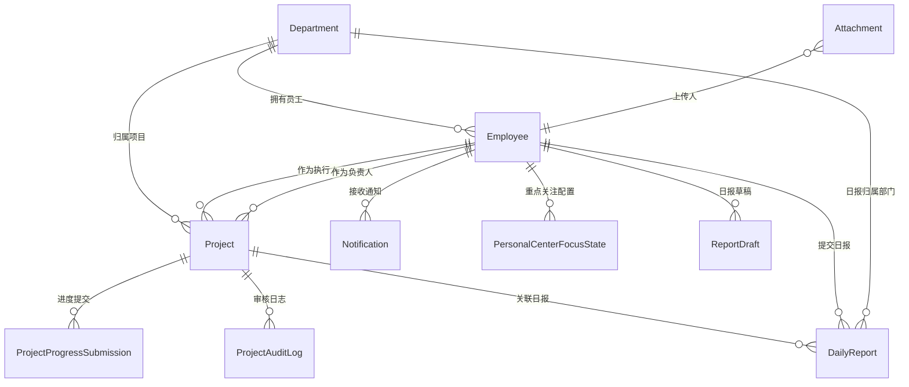

# 管理中心后台接口文档

> 适用范围：根据根目录 `个人中心.md` 与前端 `src/components/map/PersonalCenter.vue` 管理中心页面整理。  
> 后台技术栈：C# / ASP.NET Core Web API。  
> 接口前缀建议：`/api/PersonalCenter`。  
> 文档目标：按页面、功能、权限、请求参数、返回参数完整描述，供后端建表、写 Controller、DTO 和前后端联调使用。

---

## 目录

| 章节 | 标题 | 内容说明 |
|---|---|---|
| 1 | 公共约定 | 认证方式、返回结构、错误码、角色权限、枚举字典、参数选项 |
| 2 | 公共接口 | 当前用户、基础字典、附件上传、附件下载 |
| 3 | 首页概览 | 首页统计、重点关注获取、重点关注更新 |
| 4 | 员工管理页 | 部门、员工列表、新增员工、编辑员工、删除员工、执行人下拉 |
| 5 | 项目管理页 | 项目列表、详情、下发、进度提交、审核、附件打包下载 |
| 6 | 日报管理页 | 日报列表、详情、写日报、关联项目、批注、附件下载、草稿 |
| 7 | 个人设置页 | 个人资料、联系方式、头像上传、恢复默认头像 |
| 8 | 通知接口 | 通知事件、通知列表 |
| 9 | C# 后端建议模型 | Controller、实体、数据库关联表、初始化数据、权限标识 |
| 10 | 联调检查清单 | 页面接口覆盖和完整性复查 |

## 接口数量统计

统计口径：按文档中已定义的 HTTP 接口统计；同一路径不同方法分别计为不同接口；包含“可选”的日报草稿接口和通知列表接口。当前合计 **34 个接口**。

| 页面/模块 | 接口数量 | 接口范围 |
|---|---:|---|
| 公共接口 | 4 | 当前用户、基础字典、附件上传、附件下载 |
| 首页概览 | 3 | 首页概览数据、获取重点关注、更新重点关注 |
| 员工管理页 | 7 | 部门列表、新增部门、员工列表、新增员工、编辑员工、删除员工、部门执行人 |
| 项目管理页 | 7 | 项目列表、项目详情、下发项目、提交进度、审核通过、驳回项目、下载全部附件 |
| 日报管理页 | 8 | 日报列表、日报详情、写日报、关联项目、批注、下载全部附件、保存草稿、获取草稿 |
| 个人设置页 | 4 | 获取设置、保存联系方式、上传头像、恢复默认头像 |
| 通知接口 | 1 | 通知列表 |
| 合计 | 34 | 管理中心全部已设计接口 |

### 接口清单

| 序号 | 页面/模块 | 功能 | 方法 | 地址 |
|---:|---|---|---|---|
| 1 | 公共接口 | 获取当前登录用户与权限 | GET | `/api/PersonalCenter/current-user` |
| 2 | 公共接口 | 获取管理中心基础字典 | GET | `/api/PersonalCenter/options` |
| 3 | 公共接口 | 上传附件 | POST | `/api/PersonalCenter/files` |
| 4 | 公共接口 | 下载附件 | GET | `/api/PersonalCenter/files/{fileId}/download` |
| 5 | 首页概览 | 获取首页概览数据 | GET | `/api/PersonalCenter/overview` |
| 6 | 首页概览 | 获取重点关注状态 | GET | `/api/PersonalCenter/focus-state` |
| 7 | 首页概览 | 更新重点关注状态 | PUT | `/api/PersonalCenter/focus-state` |
| 8 | 员工管理页 | 获取部门列表 | GET | `/api/PersonalCenter/departments` |
| 9 | 员工管理页 | 新增部门 | POST | `/api/PersonalCenter/departments` |
| 10 | 员工管理页 | 员工列表 | GET | `/api/PersonalCenter/employees` |
| 11 | 员工管理页 | 新增员工 | POST | `/api/PersonalCenter/employees` |
| 12 | 员工管理页 | 编辑员工 | PUT | `/api/PersonalCenter/employees/{employeeId}` |
| 13 | 员工管理页 | 删除员工 | DELETE | `/api/PersonalCenter/employees/{employeeId}` |
| 14 | 员工管理页 | 根据部门获取可选执行人 | GET | `/api/PersonalCenter/departments/{departmentId}/executors` |
| 15 | 项目管理页 | 项目列表 | GET | `/api/PersonalCenter/projects` |
| 16 | 项目管理页 | 项目详情 | GET | `/api/PersonalCenter/projects/{projectId}` |
| 17 | 项目管理页 | 下发项目 | POST | `/api/PersonalCenter/projects` |
| 18 | 项目管理页 | 提交项目进度 | POST | `/api/PersonalCenter/projects/{projectId}/progress` |
| 19 | 项目管理页 | 管理员审核通过项目 | POST | `/api/PersonalCenter/projects/{projectId}/approve` |
| 20 | 项目管理页 | 管理员驳回项目 | POST | `/api/PersonalCenter/projects/{projectId}/reject` |
| 21 | 项目管理页 | 下载项目全部附件清单 | GET | `/api/PersonalCenter/projects/{projectId}/attachments/download-all` |
| 22 | 日报管理页 | 日报列表 | GET | `/api/PersonalCenter/reports` |
| 23 | 日报管理页 | 日报详情 | GET | `/api/PersonalCenter/reports/{reportId}` |
| 24 | 日报管理页 | 写日报 | POST | `/api/PersonalCenter/reports` |
| 25 | 日报管理页 | 获取可关联项目 | GET | `/api/PersonalCenter/reports/project-options` |
| 26 | 日报管理页 | 主管批注日报 | POST | `/api/PersonalCenter/reports/{reportId}/comment` |
| 27 | 日报管理页 | 下载日报全部附件 | GET | `/api/PersonalCenter/reports/{reportId}/attachments/download-all` |
| 28 | 日报管理页 | 保存日报草稿，可选 | PUT | `/api/PersonalCenter/reports/draft` |
| 29 | 日报管理页 | 获取日报草稿，可选 | GET | `/api/PersonalCenter/reports/draft` |
| 30 | 个人设置页 | 获取个人设置 | GET | `/api/PersonalCenter/settings` |
| 31 | 个人设置页 | 保存个人联系方式 | PUT | `/api/PersonalCenter/settings` |
| 32 | 个人设置页 | 上传/更换头像 | POST | `/api/PersonalCenter/settings/avatar` |
| 33 | 个人设置页 | 恢复默认头像 | DELETE | `/api/PersonalCenter/settings/avatar` |
| 34 | 通知接口 | 获取通知列表，可选 | GET | `/api/PersonalCenter/notifications` |

---

## 1. 公共约定

### 1.1 认证方式

除登录、刷新 Token 外，所有接口都需要登录态。

| 项 | 说明 |
|---|---|
| Header | `Authorization: Bearer {accessToken}` |
| Content-Type | `application/json` |
| 文件上传 | `multipart/form-data` |
| 时间格式 | 日期 `yyyy-MM-dd`，日期时间 `yyyy-MM-dd HH:mm:ss` |
| 当前用户 | 后端必须从 Token 中解析，不允许前端传 `currentUserId` 作为权限依据 |

### 1.2 统一返回结构

```json
{
  "code": 0,
  "message": "success",
  "data": {}
}
```

| 字段 | 类型 | 必填 | 说明 |
|---|---|---|---|
| code | int | 是 | `0` 成功，非 0 失败 |
| message | string | 是 | 返回提示 |
| data | any | 否 | 业务数据 |

分页接口返回结构：

```json
{
  "code": 0,
  "message": "success",
  "data": {
    "items": [],
    "total": 0,
    "pageIndex": 1,
    "pageSize": 10,
    "totalPages": 0
  }
}
```

| 字段 | 类型 | 必填 | 说明 |
|---|---|---|---|
| items | array | 是 | 当前页数据 |
| total | int | 是 | 总条数 |
| pageIndex | int | 是 | 当前页码，从 1 开始 |
| pageSize | int | 是 | 每页条数 |
| totalPages | int | 是 | 总页数 |

### 1.3 通用错误码

| code | HTTP | 说明 |
|---|---:|---|
| 0 | 200 | 成功 |
| 40001 | 400 | 参数错误 |
| 40101 | 401 | 未登录或 Token 过期 |
| 40301 | 403 | 无权限 |
| 40401 | 404 | 数据不存在 |
| 40901 | 409 | 数据冲突，例如同日重复提交日报 |
| 50001 | 500 | 服务端异常 |

### 1.4 角色与权限

| role | 中文名 | 权限范围 |
|---|---|---|
| admin | 管理员 | 查看全量数据；管理全部员工、部门、项目、日报；可做项目最终审核 |
| manager | 部门主管 | 查看本部门员工、项目、日报；可新增/编辑本部门员工；可下发本部门项目；可批注本部门日报；可填写自己的日报 |
| employee | 员工 | 查看本人项目和日报；可提交本人项目进度；可填写本人的日报；可维护个人联系方式与头像 |

### 1.5 数据范围规则

| 场景 | 管理员 | 部门主管 | 员工 |
|---|---|---|---|
| 首页概览 | 全公司 | 本部门 | 本人 |
| 员工列表 | 全部员工 | 本部门员工 | 无权限 |
| 项目列表 | 全部项目 | 本部门项目 | 本人执行项目 |
| 日报列表 | 全部日报 | 本部门日报 | 本人日报 |
| 下发项目 | 可选任意部门与执行人 | 只能本部门 | 无权限 |
| 提交项目进度 | 无权限 | 无权限 | 仅本人执行且进行中的项目 |
| 项目审核 | 仅管理员 | 无权限 | 无权限 |
| 日报批注 | 不强制批注，默认不提供批注按钮 | 仅本部门日报 | 无权限 |
| 个人设置 | 本人 | 本人 | 本人 |

### 1.6 枚举字典

#### 员工状态 `EmployeeStatus`

| 值 | 说明 |
|---|---|
| 在职 | 正常在职 |
| 试用 | 试用期 |
| 离职 | 离职 |

#### 项目状态 `ProjectStatus`

| 值 | 说明 |
|---|---|
| 进行中 | 项目正在推进 |
| 待审核 | 员工已提交任一分支的回款完成 100%，等待管理员审核 |
| 已完成 | 管理员审核通过，项目结束 |

#### 项目优先级 `ProjectPriority`

| 值 | 说明 |
|---|---|
| 高 | 高优先级 |
| 中 | 中优先级 |
| 低 | 低优先级 |

#### 项目固定节点 `ProjectStage`

| stageKey | 中文名 | 进度规则 | 是否员工可选 |
|---|---|---|---|
| task_issued | 任务下发 | 固定 0% | 否 |
| contract_signed | 合同签订 | 固定 10% | 是 |
| task_execution | 任务执行中 | 10% 到 80%，不可低于当前进度 | 是 |
| invoice_completed | 开票完成 | 固定 90% | 是 |
| prepayment_invoice | 预付款开票 | 固定 85%，任务执行中达到 80% 后可进入预付款分支 | 是 |
| prepayment_received | 预付款回款 | 固定 90% | 是 |
| final_invoice_completed | 开票完成 | 固定 95%，预付款分支中的最终开票节点 | 是 |
| payment_received | 回款完成 | 固定 100%，提交后项目进入待审核 | 是 |

#### 日报状态 `ReportStatus`

| 值 | 说明 |
|---|---|
| 已提交 | 员工/主管已提交，主管尚未批注 |
| 已批注 | 主管已批注 |

#### 日报评分 `ReportScore`

| 值 | 说明 |
|---|---|
| 优 | 表现优秀 |
| 良 | 表现良好 |
| 需跟进 | 需要继续关注 |

### 1.7 附件对象 `AttachmentDto`

| 字段 | 类型 | 必填 | 说明 |
|---|---|---|---|
| id | string | 是 | 附件 ID |
| fileName | string | 是 | 原始文件名 |
| fileExt | string | 是 | 文件扩展名，例如 `.pdf` |
| fileSize | long | 是 | 字节数 |
| contentType | string | 是 | MIME 类型 |
| url | string | 是 | 下载地址 |
| uploadedBy | string | 是 | 上传人姓名 |
| uploadedAt | datetime | 是 | 上传时间 |

### 1.8 分页查询参数 `PageQuery`

| 字段 | 类型 | 必填 | 默认值 | 说明 |
|---|---|---|---|---|
| pageIndex | int | 否 | 1 | 页码，从 1 开始 |
| pageSize | int | 否 | 10 | 每页条数，允许 10/20/50 |

### 1.9 参数选项总表

> 说明：所有接口中，只要字段名与本节一致，固定可选值均以本节为准。  
> ID 类参数如 `employeeId`、`departmentId`、`projectId`、`reportId`、`fileId` 没有固定枚举值，必须来自对应列表接口或详情接口返回的数据。  
> 文本、日期、数字类参数没有固定选项时，按参数表中的校验规则填写。

#### 角色参数 `role`

| 参数值 | 中文说明 | 可用页面/接口 |
|---|---|---|
| admin | 管理员，可查看和管理全量数据，可做项目最终审核 | 全部页面 |
| manager | 部门主管，只能管理本部门员工、项目、日报，可批注本部门日报 | 首页、员工、项目、日报、设置 |
| employee | 员工，只能查看本人项目和日报，可提交本人项目进度和日报 | 首页、项目、日报、设置 |

#### 页面标识参数 `section` / `visibleSections`

| 参数值 | 中文说明 | 允许角色 |
|---|---|---|
| overview | 首页概览，展示统计卡、项目图表、日报图表、即将到期项目 | admin / manager / employee |
| employees | 员工管理，展示员工列表、新增/编辑/删除员工、新增部门 | admin / manager |
| projects | 项目管理，展示项目列表、详情、下发、进度提交、审核 | admin / manager / employee |
| reports | 日报管理，展示日报列表、详情、填写日报、主管批注 | admin / manager / employee |
| settings | 个人设置，展示头像、手机号、邮箱、只读基础资料 | admin / manager / employee |

#### 概览时间范围参数 `range`

| 参数值 | 中文说明 | 统计口径 |
|---|---|---|
| 7d | 近 7 天 | 从服务器当前日期向前取 7 天 |
| 30d | 近 30 天 | 从服务器当前日期向前取 30 天 |
| month | 本月 | 服务器当前日期所在自然月 |

#### 项目趋势模式参数 `trendMode` / `mode`

| 参数值 | 中文说明 | 图表含义 |
|---|---|---|
| new | 新增项目趋势 | 柱状图为每日新增项目数，折线图为累计项目数 |
| progress | 项目推进趋势 | 柱状图为每日进度提交次数，折线图为每日平均推进进度 |

#### 首页统计范围参数 `scope`

| 参数值 | 中文说明 | 对应角色 |
|---|---|---|
| company | 公司全量范围 | admin |
| department | 当前部门范围 | manager |
| personal | 当前登录人个人范围 | employee |

#### 首页统计卡参数 `summaryCards.key`

| 参数值 | 中文说明 | 常见角色 |
|---|---|---|
| totalEmployees | 员工总数 | admin |
| totalProjects | 项目总数 | admin |
| activeProjects | 进行中项目数 | admin / manager |
| todayReports | 今日日报提交数或提交率 | admin |
| deptEmployees | 部门员工数 | manager |
| deptProjects | 部门项目数 | manager |
| completionRate | 部门项目完成率 | manager |
| deptReports | 部门日报提交率 | manager |
| myProjects | 我的项目数 | employee |
| completedProjects | 我的已完成项目数 | employee |
| monthlyReports | 本月日报数 | employee |
| submissionRate | 个人日报提交率 | employee |
| reports | 当前周期日报数 | employee |

#### 快捷操作参数 `quickActions.key`

| 参数值 | 中文说明 | route | 所需权限 |
|---|---|---|---|
| createEmployee | 新增员工 | `/profile/employees/add` | `employee:create` |
| createDepartment | 新增部门 | `/profile/employees` | `department:create` |
| createProject | 下发项目 | `/profile/projects/distribute` | `project:create` |
| viewProjects | 查看项目列表 | `/profile/projects` | `project:view` |
| writeReport | 写今日日报 | `/profile/reports/write` | `report:create` |
| viewReports | 查看日报列表 | `/profile/reports` | `report:view` |
| viewSettings | 查看个人设置 | `/profile/settings` | `settings:view` |

#### 员工状态参数 `status`，员工相关接口

| 参数值 | 中文说明 | 使用位置 |
|---|---|---|
| 在职 | 正式在职员工，可参与项目和日报统计 | 员工列表筛选、新增/编辑员工 |
| 试用 | 试用期员工，可参与项目和日报统计 | 员工列表筛选、新增/编辑员工 |
| 离职 | 已离职员工，通常不允许作为新项目执行人 | 员工列表筛选、新增/编辑员工 |

#### 项目状态参数 `status`，项目相关接口

| 参数值 | 中文说明 | 使用位置 |
|---|---|---|
| 进行中 | 项目未结束，员工可继续提交进度 | 项目列表筛选、项目详情 |
| 待审核 | 员工提交到回款完成 100%，等待管理员最终审核 | 项目列表筛选、项目详情、审核接口 |
| 已完成 | 管理员审核通过，项目彻底结束 | 项目列表筛选、项目详情 |

#### 项目优先级参数 `priority`

| 参数值 | 中文说明 | 使用位置 |
|---|---|---|
| 高 | 高优先级，列表和即将到期卡片需突出展示 | 项目筛选、下发项目、项目详情 |
| 中 | 中优先级，前端默认值 | 项目筛选、下发项目、项目详情 |
| 低 | 低优先级 | 项目筛选、下发项目、项目详情 |

#### 项目进度筛选参数 `progressMin`

| 参数值 | 中文说明 | 后端筛选条件 |
|---:|---|---|
| 10 | 已完成 10% 及以上 | `progress >= 10` |
| 30 | 已完成 30% 及以上 | `progress >= 30` |
| 50 | 已完成 50% 及以上 | `progress >= 50` |
| 70 | 已完成 70% 及以上 | `progress >= 70` |
| 90 | 已完成 90% 及以上 | `progress >= 90` |
| 100 | 已完成 100% | `progress = 100` |

#### 项目节点参数 `stageKey` / `currentStageKey`

| 参数值 | 中文说明 | 进度值/范围 | 流转说明 |
|---|---|---|---|
| task_issued | 任务下发 | 0% | 项目下发后的初始节点，员工不可主动选择 |
| contract_signed | 合同签订 | 固定 10% | 从任务下发进入合同签订 |
| task_execution | 任务执行中 | 10%-80% | 可多次提交，进度不可低于当前进度 |
| invoice_completed | 开票完成 | 固定 90% | 标准流程：任务执行中达到 80% 后可进入 |
| prepayment_invoice | 预付款开票 | 固定 85% | 预付款分支：任务执行中达到 80% 后可进入 |
| prepayment_received | 预付款回款 | 固定 90% | 预付款分支：预付款开票后进入 |
| final_invoice_completed | 开票完成 | 固定 95% | 预付款分支：预付款回款后进入最终开票 |
| payment_received | 回款完成 | 固定 100% | 标准流程或预付款分支最终进入，提交后项目变为待审核 |

#### 项目时间线类型参数 `timeline.type`

| 参数值 | 中文说明 | 来源接口/动作 |
|---|---|---|
| issued | 项目下发 | POST `/projects` |
| progress | 进度更新 | POST `/projects/{projectId}/progress` |
| audit_pass | 审核通过 | POST `/projects/{projectId}/approve` |
| audit_reject | 审核驳回 | POST `/projects/{projectId}/reject` |

#### 日报状态参数 `status`，日报相关接口

| 参数值 | 中文说明 | 使用位置 |
|---|---|---|
| 已提交 | 已提交但主管尚未批注 | 日报列表筛选、日报详情、日报提交后初始状态 |
| 已批注 | 主管已经填写批注 | 日报列表筛选、日报详情、批注接口返回 |

#### 日报评分参数 `score`

| 参数值 | 中文说明 | 使用位置 |
|---|---|---|
| 优 | 工作完成质量优秀 | 主管批注日报 |
| 良 | 工作完成质量良好 | 主管批注日报 |
| 需跟进 | 存在问题或需要继续关注 | 主管批注日报 |

#### 日报今日状态参数 `todayStatus`

| 参数值 | 中文说明 | 使用位置 |
|---|---|---|
| 待提交 | 当前用户今天还没有提交日报 | 首页日报统计、日报列表 |
| 已提交 | 当前用户今天已提交但未批注 | 首页日报统计、日报列表 |
| 已批注 | 当前用户今天日报已被主管批注 | 首页日报统计、日报列表 |

#### 文件业务类型参数 `bizType`

| 参数值 | 中文说明 | 支持格式 | 大小限制 |
|---|---|---|---|
| project | 项目下发附件 | jpg、png、pdf、doc、docx、xls、xlsx、zip | 单个最大 20MB，最多 20 个 |
| projectProgress | 项目进度附件 | jpg、png、pdf、doc、docx | 单个最大 10MB，最多 10 个 |
| report | 日报附件 | jpg、png、pdf、doc、docx、xls、xlsx | 单个最大 10MB，最多 10 个 |
| avatar | 用户头像 | jpg、png、gif | 单个最大 2MB |

#### 通知参数 `notification.type`

| 参数值 | 中文说明 | 触发动作 |
|---|---|---|
| project_assigned | 新项目下发通知 | 项目下发成功 |
| project_progress_updated | 项目进度更新通知 | 员工提交项目进度 |
| report_submitted | 日报提交通知 | 员工/主管提交日报 |
| report_commented | 日报批注通知 | 主管批注日报 |
| project_approved | 项目审核通过通知 | 管理员审核通过 |
| project_rejected | 项目审核驳回通知 | 管理员驳回项目 |

#### 业务类型参数 `bizType`，通知和附件关联使用

| 参数值 | 中文说明 | 对应业务 |
|---|---|---|
| project | 项目业务 | 项目下发、项目详情、项目审核 |
| projectProgress | 项目进度业务 | 员工提交项目进度 |
| report | 日报业务 | 日报提交、日报详情、日报批注 |
| avatar | 头像业务 | 个人设置头像 |

#### 布尔参数

| 参数值 | 中文说明 |
|---|---|
| true | 是、启用、已读、允许、已关注，具体含义看字段说明 |
| false | 否、禁用、未读、不允许、未关注，具体含义看字段说明 |

#### 分页参数 `pageSize`

| 参数值 | 中文说明 |
|---:|---|
| 10 | 每页 10 条，默认值 |
| 20 | 每页 20 条 |
| 50 | 每页 50 条 |

---

## 2. 公共接口

### 2.1 获取当前登录用户与权限

| 项 | 内容 |
|---|---|
| 页面 | 管理中心全部页面 |
| 功能 | 初始化当前用户、角色、菜单权限 |
| 方法 | GET |
| 地址 | `/api/PersonalCenter/current-user` |
| 权限 | admin / manager / employee |

请求参数：无。

返回参数：

| 字段 | 类型 | 必填 | 说明 |
|---|---|---|---|
| id | string | 是 | 当前用户 ID |
| userName | string | 是 | 登录账号 |
| name | string | 是 | 姓名 |
| role | string | 是 | 角色：`admin` 管理员；`manager` 部门主管；`employee` 员工 |
| roleName | string | 是 | 中文角色名：`管理员` / `部门主管` / `员工` |
| departmentId | string | 否 | 部门 ID |
| department | string | 否 | 部门名称 |
| position | string | 否 | 职位 |
| phone | string | 否 | 手机号 |
| email | string | 否 | 邮箱 |
| status | string | 是 | 员工状态：`在职` 正常在职；`试用` 试用期；`离职` 已离职 |
| avatarUrl | string | 否 | 头像地址 |
| permissions | array<string> | 是 | 权限标识集合：见 9.6，例如 `project:view` 查看项目、`report:create` 写日报 |
| visibleSections | array<string> | 是 | 可见页面：`overview` 首页；`employees` 员工管理；`projects` 项目管理；`reports` 日报管理；`settings` 个人设置 |

返回示例：

```json
{
  "code": 0,
  "message": "success",
  "data": {
    "id": "emp-004",
    "userName": "staff.li",
    "name": "李安",
    "role": "employee",
    "roleName": "员工",
    "departmentId": "dept-001",
    "department": "测绘一部",
    "position": "外业工程师",
    "phone": "13800000004",
    "email": "li_an@szkj.local",
    "status": "在职",
    "avatarUrl": "https://example.com/avatar/emp-004.png",
    "permissions": ["project:progress:create", "report:create", "settings:update"],
    "visibleSections": ["overview", "projects", "reports", "settings"]
  }
}
```

### 2.2 获取管理中心基础字典

| 项 | 内容 |
|---|---|
| 页面 | 管理中心全部页面 |
| 功能 | 获取角色、状态、优先级、项目节点、分页选项等 |
| 方法 | GET |
| 地址 | `/api/PersonalCenter/options` |
| 权限 | admin / manager / employee |

请求参数：无。

返回参数：

| 字段 | 类型 | 必填 | 说明 |
|---|---|---|---|
| roles | array<OptionDto> | 是 | 角色选项：`admin` 管理员；`manager` 部门主管；`employee` 员工 |
| employeeStatuses | array<OptionDto> | 是 | 员工状态：`在职`、`试用`、`离职` |
| projectStatuses | array<OptionDto> | 是 | 项目状态：`进行中`、`待审核`、`已完成` |
| projectPriorities | array<OptionDto> | 是 | 项目优先级：`高`、`中`、`低` |
| projectStages | array<ProjectStageDto> | 是 | 项目固定节点：见 1.9 `项目节点参数` |
| reportStatuses | array<OptionDto> | 是 | 日报状态：`已提交`、`已批注` |
| reportScores | array<OptionDto> | 是 | 日报评分：`优`、`良`、`需跟进` |
| pageSizes | array<int> | 是 | 分页条数选项：`10`、`20`、`50` |
| overviewRanges | array<OptionDto> | 是 | 概览时间范围：`7d` 近 7 天；`30d` 近 30 天；`month` 本月 |

`OptionDto`：

| 字段 | 类型 | 必填 | 说明 |
|---|---|---|---|
| label | string | 是 | 展示文本 |
| value | string | 是 | 真实值 |

`ProjectStageDto`：

| 字段 | 类型 | 必填 | 说明 |
|---|---|---|---|
| key | string | 是 | 节点 key：`task_issued` 任务下发；`contract_signed` 合同签订；`task_execution` 任务执行中；`invoice_completed` 开票完成；`prepayment_invoice` 预付款开票；`prepayment_received` 预付款回款；`final_invoice_completed` 开票完成；`payment_received` 回款完成 |
| label | string | 是 | 节点名称 |
| min | int | 是 | 最小进度 |
| max | int | 是 | 最大进度 |
| fixedProgress | int? | 否 | 固定进度 |
| selectable | bool | 是 | 员工是否可选 |

### 2.3 上传附件

| 项 | 内容 |
|---|---|
| 页面 | 项目下发、项目进度提交、日报填写、个人头像 |
| 功能 | 上传业务附件 |
| 方法 | POST |
| 地址 | `/api/PersonalCenter/files` |
| 权限 | admin / manager / employee，按业务场景二次校验 |
| Content-Type | `multipart/form-data` |

请求参数：

| 字段 | 类型 | 必填 | 可选值 | 中文说明 |
|---|---|---|---|---|
| bizType | string | 是 | `project` 项目附件；`projectProgress` 项目进度附件；`report` 日报附件；`avatar` 用户头像 | 文件所属业务类型 |
| bizId | string | 否 | 已存在业务 ID，如项目 ID、进度提交 ID、日报 ID；新增业务前可为空 | 业务 ID |
| files | file[] | 是 | 本地选择的文件数组 | 文件数组 |

文件限制：

| 场景 | 支持格式 | 限制 |
|---|---|---|
| 头像 | jpg / png / gif | 单个最大 2MB |
| 项目附件 | jpg / png / pdf / doc / docx / xls / xlsx / zip | 单个最大 20MB，最多 20 个 |
| 项目进度附件 | jpg / png / pdf / doc / docx | 单个最大 10MB，最多 10 个 |
| 日报附件 | jpg / png / pdf / doc / docx / xls / xlsx | 单个最大 10MB，最多 10 个 |

返回参数：

| 字段 | 类型 | 必填 | 说明 |
|---|---|---|---|
| files | array<AttachmentDto> | 是 | 上传成功的附件集合 |

### 2.4 下载附件

| 项 | 内容 |
|---|---|
| 页面 | 项目详情、日报详情 |
| 功能 | 下载单个附件 |
| 方法 | GET |
| 地址 | `/api/PersonalCenter/files/{fileId}/download` |
| 权限 | 对应业务数据可见者 |

路径参数：

| 字段 | 类型 | 必填 | 说明 |
|---|---|---|---|
| fileId | string | 是 | 附件 ID |

返回：文件流。

---

## 3. 首页概览

### 3.1 获取首页概览数据

| 项 | 内容 |
|---|---|
| 页面 | 首页概览 `/profile` |
| 功能 | 统计卡片、项目状态分布、趋势图、日报统计、即将到期、快捷入口 |
| 方法 | GET |
| 地址 | `/api/PersonalCenter/overview` |
| 权限 | admin / manager / employee |

权限说明：

| 角色 | 数据范围 |
|---|---|
| admin | 全公司员工、项目、日报 |
| manager | 当前主管所属部门 |
| employee | 当前员工本人执行项目与本人日报 |

请求参数：

| 字段 | 类型 | 必填 | 默认值 | 可选值 | 中文说明 |
|---|---|---|---|---|---|
| range | string | 否 | `7d` | `7d` 近 7 天；`30d` 近 30 天；`month` 本月 | 统计时间范围 |
| trendMode | string | 否 | `new` | `new` 新增项目趋势；`progress` 项目推进趋势 | 项目趋势图展示模式 |

返回参数：

| 字段 | 类型 | 必填 | 说明 |
|---|---|---|---|
| scope | string | 是 | `company` 公司全量；`department` 部门范围；`personal` 个人范围 |
| baseDate | date | 是 | 统计基准日期，按服务器当前日期 |
| summaryCards | array<SummaryCardDto> | 是 | 顶部统计卡 |
| projectStatusDistribution | array<ChartItemDto> | 是 | 项目状态分布 |
| projectTrend | ProjectTrendDto | 是 | 项目趋势 |
| upcomingProjects | array<UpcomingProjectDto> | 是 | 未来 7 天即将到期项目，最多 8 条 |
| reportStats | ReportOverviewStatsDto | 是 | 日报统计 |
| employeeDistribution | array<ChartItemDto> | 否 | 员工分布，员工角色可为空 |
| adminProgressFeed | array<ProjectProgressFeedDto> | 否 | 管理员任务进度提交列表，最多 5 条 |
| quickActions | array<QuickActionDto> | 是 | 当前角色快捷操作入口 |
| focusState | PersonalCenterFocusStateDto | 是 | 当前用户重点关注状态 |

`SummaryCardDto`：

| 字段 | 类型 | 必填 | 说明 |
|---|---|---|---|
| key | string | 是 | 卡片 key |
| label | string | 是 | 标题 |
| value | string | 是 | 展示值 |
| hint | string | 是 | 辅助说明 |
| trend | string | 否 | 趋势文案 |

`ChartItemDto`：

| 字段 | 类型 | 必填 | 说明 |
|---|---|---|---|
| name | string | 是 | 名称 |
| value | number | 是 | 数值 |
| percent | decimal | 否 | 占比 |

`ProjectTrendDto`：

| 字段 | 类型 | 必填 | 说明 |
|---|---|---|---|
| mode | string | 是 | `new` 新增项目趋势；`progress` 项目推进趋势 |
| labels | array<string> | 是 | 横轴日期 |
| bars | array<number> | 是 | 柱状数据。新增项目数或进度更新次数 |
| line | array<number> | 是 | 折线数据。累计项目数或平均进度 |
| description | string | 是 | 图表说明 |

`UpcomingProjectDto`：

| 字段 | 类型 | 必填 | 说明 |
|---|---|---|---|
| id | string | 是 | 项目 ID |
| projectName | string | 是 | 项目名称 |
| department | string | 是 | 所属部门 |
| executor | string | 是 | 执行人 |
| deadline | date | 是 | 截止日期 |
| daysLeft | int | 是 | 剩余天数，逾期为负数 |
| progress | int | 是 | 当前进度 |
| status | string | 是 | 项目状态：`进行中` 正在推进；`待审核` 等待管理员审核；`已完成` 已结束 |
| priority | string | 是 | 优先级：`高` 高优先级；`中` 中优先级；`低` 低优先级 |
| isFocused | bool | 是 | 当前用户是否重点关注 |

`ReportOverviewStatsDto`：

| 字段 | 类型 | 必填 | 说明 |
|---|---|---|---|
| todaySubmitted | int | 是 | 今日已提交数 |
| pending | int | 是 | 未提交或待提交数 |
| submittedDays | int | 否 | 员工个人已提交天数 |
| pendingDays | int | 否 | 员工个人待提交天数 |
| todayStatus | string | 是 | 今日状态：`待提交` 今天未写日报；`已提交` 已提交未批注；`已批注` 已被主管批注 |
| submitRate | decimal | 是 | 提交率百分比 |
| rangeReportCount | int | 是 | 当前周期日报条数 |

`ProjectProgressFeedDto`：

| 字段 | 类型 | 必填 | 说明 |
|---|---|---|---|
| id | string | 是 | 进度消息 ID |
| projectId | string | 是 | 项目 ID |
| projectName | string | 是 | 项目名称 |
| department | string | 是 | 部门 |
| operator | string | 是 | 提交人 |
| stageKey | string | 是 | 节点 key：见 1.9 `项目节点参数` |
| stageLabel | string | 是 | 节点名称 |
| progress | int | 是 | 进度百分比 |
| content | string | 是 | 进度说明 |
| date | datetime | 是 | 提交时间 |
| isFocused | bool | 是 | 当前用户是否重点关注 |

`QuickActionDto`：

| 字段 | 类型 | 必填 | 说明 |
|---|---|---|---|
| key | string | 是 | 操作 key：`createEmployee` 新增员工；`createDepartment` 新增部门；`createProject` 下发项目；`viewProjects` 查看项目；`writeReport` 写日报；`viewReports` 查看日报；`viewSettings` 个人设置 |
| title | string | 是 | 标题 |
| description | string | 是 | 描述 |
| route | string | 是 | 前端跳转路由 |
| permission | string | 是 | 所需权限 |

### 3.2 获取重点关注状态

| 项 | 内容 |
|---|---|
| 页面 | 首页概览 |
| 功能 | 获取当前用户对即将到期项目、管理员进度消息的置顶关注配置 |
| 方法 | GET |
| 地址 | `/api/PersonalCenter/focus-state` |
| 权限 | admin / manager / employee |

请求参数：无。

返回参数 `PersonalCenterFocusStateDto`：

| 字段 | 类型 | 必填 | 说明 |
|---|---|---|---|
| upcomingProjectIds | array<string> | 是 | 即将到期项目关注 ID 集合 |
| adminProgressFeedIds | array<string> | 是 | 管理员任务进度消息关注 ID 集合；非管理员可为空数组 |
| updatedAt | datetime | 否 | 最近更新时间 |

### 3.3 更新重点关注状态

| 项 | 内容 |
|---|---|
| 页面 | 首页概览 |
| 功能 | 保存当前用户重点关注配置 |
| 方法 | PUT |
| 地址 | `/api/PersonalCenter/focus-state` |
| 权限 | admin / manager / employee |

请求参数：

| 字段 | 类型 | 必填 | 可选值 | 中文说明 |
|---|---|---|---|---|
| upcomingProjectIds | array<string> | 否 | 当前用户可见项目 ID，例如 `proj-001` | 即将到期项目关注 ID 集合 |
| adminProgressFeedIds | array<string> | 否 | 管理员可见进度消息 ID，例如 `progress-001`；非管理员传空数组 | 管理员进度消息关注 ID 集合，仅 admin 有效 |

业务规则：

| 规则 | 说明 |
|---|---|
| 账号隔离 | 关注状态必须按当前登录用户保存 |
| 数据校验 | 项目 ID 必须在当前用户可见范围内 |
| 非管理员 | `adminProgressFeedIds` 应保存为空或忽略 |

返回参数：同 `PersonalCenterFocusStateDto`。

---

## 4. 员工管理页

### 4.1 获取部门列表

| 项 | 内容 |
|---|---|
| 页面 | 员工管理、项目下发、日报筛选 |
| 功能 | 获取部门下拉选项 |
| 方法 | GET |
| 地址 | `/api/PersonalCenter/departments` |
| 权限 | admin / manager |

权限说明：

| 角色 | 返回范围 |
|---|---|
| admin | 全部部门 |
| manager | 当前主管所在部门 |

请求参数：

| 字段 | 类型 | 必填 | 默认值 | 可选值 | 中文说明 |
|---|---|---|---|---|---|
| keyword | string | 否 | 空 | 任意部门名称关键词 | 部门名称搜索 |

返回参数：

| 字段 | 类型 | 必填 | 说明 |
|---|---|---|---|
| id | string | 是 | 部门 ID |
| name | string | 是 | 部门名称 |
| employeeCount | int | 是 | 员工数量 |
| managerId | string | 否 | 部门主管 ID |
| managerName | string | 否 | 部门主管姓名 |

### 4.2 新增部门

| 项 | 内容 |
|---|---|
| 页面 | 员工管理 |
| 功能 | 新增部门 |
| 方法 | POST |
| 地址 | `/api/PersonalCenter/departments` |
| 权限 | admin |

请求参数：

| 字段 | 类型 | 必填 | 校验 | 可选值 | 中文说明 |
|---|---|---|---|---|---|
| name | string | 是 | 1-20 字符，不能重复 | 任意部门名称，例如 `测绘一部` | 部门名称 |
| managerId | string | 否 | 必须为现有员工 | 员工列表返回的主管员工 `id`；也可为空 | 部门主管 |

返回参数：

| 字段 | 类型 | 必填 | 说明 |
|---|---|---|---|
| id | string | 是 | 部门 ID |
| name | string | 是 | 部门名称 |
| employeeCount | int | 是 | 员工数量，新增时为 0 |
| managerId | string | 否 | 部门主管 ID |
| managerName | string | 否 | 部门主管姓名 |
| createdAt | datetime | 是 | 创建时间 |

### 4.3 员工列表

| 项 | 内容 |
|---|---|
| 页面 | 员工管理 `/profile/employees` |
| 功能 | 员工表格、搜索、部门筛选、状态筛选、分页 |
| 方法 | GET |
| 地址 | `/api/PersonalCenter/employees` |
| 权限 | admin / manager |

权限说明：

| 角色 | 数据范围 |
|---|---|
| admin | 全部员工 |
| manager | 仅本部门员工，`departmentId` 参数无效或只能等于本部门 |
| employee | 无权限 |

请求参数：

| 字段 | 类型 | 必填 | 默认值 | 可选值 | 中文说明 |
|---|---|---|---|---|---|
| keyword | string | 否 | 空 | 任意姓名、账号、电话、邮箱、职位关键词 | 员工关键词搜索 |
| departmentId | string | 否 | 空 | 部门列表返回的 `id`；管理员可选全部部门，主管只能本部门 | 部门筛选 |
| status | string | 否 | 空 | `在职` 正式在职；`试用` 试用期；`离职` 已离职 | 员工状态筛选 |
| pageIndex | int | 否 | 1 | 大于等于 1 的整数 | 页码 |
| pageSize | int | 否 | 10 | `10` 每页 10 条；`20` 每页 20 条；`50` 每页 50 条 | 每页条数 |

返回参数 `EmployeeDto`：

| 字段 | 类型 | 必填 | 说明 |
|---|---|---|---|
| id | string | 是 | 员工 ID |
| avatarUrl | string | 否 | 头像 |
| userName | string | 是 | 登录账号 |
| name | string | 是 | 姓名 |
| role | string | 是 | 角色：`admin` 管理员；`manager` 部门主管；`employee` 员工 |
| roleName | string | 是 | 角色中文：`管理员` / `部门主管` / `员工` |
| departmentId | string | 是 | 部门 ID |
| department | string | 是 | 部门名称 |
| position | string | 是 | 职位 |
| phone | string | 是 | 手机号 |
| email | string | 否 | 邮箱 |
| status | string | 是 | 员工状态：`在职` 正常在职；`试用` 试用期；`离职` 已离职 |
| createdAt | datetime | 是 | 创建时间 |
| canEdit | bool | 是 | 当前用户是否可编辑 |
| canDelete | bool | 是 | 当前用户是否可删除 |

### 4.4 新增员工

| 项 | 内容 |
|---|---|
| 页面 | 员工管理 |
| 功能 | 新增员工并创建平台账号 |
| 方法 | POST |
| 地址 | `/api/PersonalCenter/employees` |
| 权限 | admin / manager |

权限说明：

| 角色 | 规则 |
|---|---|
| admin | 可选择任意部门 |
| manager | 只能新增到本部门，后端忽略或拒绝其它部门 |

请求参数：

| 字段 | 类型 | 必填 | 校验 | 可选值 | 中文说明 |
|---|---|---|---|---|---|
| name | string | 是 | 2-20 字符 | 任意中文/英文姓名 | 姓名 |
| userName | string | 是 | 3-30 位字母、数字、点、下划线或中划线；唯一 | 例如 `zhangsan`、`staff.li` | 平台账号 |
| password | string | 是 | 至少 6 位 | 前端默认 `Qaz!123`，也可传其它初始密码 | 初始密码 |
| phone | string | 是 | `^1\d{10}$` | 11 位中国大陆手机号 | 手机号 |
| email | string | 否 | 邮箱格式 | 例如 `user@example.com` | 邮箱 |
| departmentId | string | 是 | 必须存在 | 部门列表返回的 `id`；主管只能本部门 | 部门 ID |
| position | string | 是 | 2-30 字符 | 例如 `外业工程师`、`数据处理工程师` | 职位 |
| status | string | 是 | 在职/试用/离职 | `在职` 正式在职；`试用` 试用期；`离职` 已离职 | 员工状态 |

返回参数：`EmployeeDto`。

业务规则：

| 规则 | 说明 |
|---|---|
| 默认角色 | 新增员工默认为 `employee` |
| 账号唯一 | `userName` 全局唯一 |
| 密码保存 | 后端必须加密存储，不返回明文密码 |
| 主管新增 | 部门强制为当前主管部门 |

### 4.5 编辑员工

| 项 | 内容 |
|---|---|
| 页面 | 员工管理 |
| 功能 | 编辑员工基础信息 |
| 方法 | PUT |
| 地址 | `/api/PersonalCenter/employees/{employeeId}` |
| 权限 | admin / manager |

路径参数：

| 字段 | 类型 | 必填 | 说明 |
|---|---|---|---|
| employeeId | string | 是 | 员工 ID |

请求参数：

| 字段 | 类型 | 必填 | 校验 | 可选值 | 中文说明 |
|---|---|---|---|---|---|
| name | string | 是 | 2-20 字符 | 任意中文/英文姓名 | 姓名 |
| phone | string | 是 | `^1\d{10}$` | 11 位中国大陆手机号 | 手机号 |
| email | string | 否 | 邮箱格式 | 例如 `user@example.com` | 邮箱 |
| departmentId | string | 是 | 必须存在 | 部门列表返回的 `id`；主管只能本部门 | 部门 ID |
| position | string | 是 | 2-30 字符 | 例如 `外业工程师`、`数据处理工程师` | 职位 |
| status | string | 是 | 在职/试用/离职 | `在职` 正式在职；`试用` 试用期；`离职` 已离职 | 员工状态 |

返回参数：`EmployeeDto`。

业务规则：

| 规则 | 说明 |
|---|---|
| manager 数据范围 | 只能编辑本部门员工，不能把员工调到其它部门 |
| 账号不可改 | 当前前端编辑弹窗不允许修改 `userName` |
| 角色保护 | 管理员账号、主管账号、系统内置账号不允许被普通编辑降权或删除 |

### 4.6 删除员工

| 项 | 内容 |
|---|---|
| 页面 | 员工管理 |
| 功能 | 删除员工 |
| 方法 | DELETE |
| 地址 | `/api/PersonalCenter/employees/{employeeId}` |
| 权限 | admin / manager |

路径参数：

| 字段 | 类型 | 必填 | 说明 |
|---|---|---|---|
| employeeId | string | 是 | 员工 ID |

返回参数：

| 字段 | 类型 | 必填 | 说明 |
|---|---|---|---|
| success | bool | 是 | 是否删除成功 |

业务规则：

| 规则 | 说明 |
|---|---|
| 删除范围 | manager 只能删除本部门员工 |
| 保护对象 | admin、manager、系统测试/内置账号不允许删除 |
| 项目关联 | 如员工存在进行中项目，建议禁止硬删除，返回错误提示 |
| 推荐实现 | 逻辑删除，将状态置为离职或 `IsDeleted=true` |

### 4.7 根据部门获取可选执行人

| 项 | 内容 |
|---|---|
| 页面 | 项目下发 |
| 功能 | 部门选择后联动执行人下拉 |
| 方法 | GET |
| 地址 | `/api/PersonalCenter/departments/{departmentId}/executors` |
| 权限 | admin / manager |

路径参数：

| 字段 | 类型 | 必填 | 说明 |
|---|---|---|---|
| departmentId | string | 是 | 部门 ID |

请求参数：

| 字段 | 类型 | 必填 | 默认值 | 可选值 | 中文说明 |
|---|---|---|---|---|---|
| keyword | string | 否 | 空 | 任意员工姓名或账号关键词 | 执行人搜索 |

返回参数：

| 字段 | 类型 | 必填 | 说明 |
|---|---|---|---|
| id | string | 是 | 员工 ID |
| name | string | 是 | 员工姓名 |
| userName | string | 是 | 登录账号 |
| departmentId | string | 是 | 部门 ID |
| department | string | 是 | 部门名称 |
| position | string | 是 | 职位 |
| status | string | 是 | 员工状态：`在职` 正常在职；`试用` 试用期；`离职` 已离职 |

业务规则：仅返回 `status=在职` 或业务允许接任务的员工。

---

## 5. 项目管理页

### 5.1 项目列表

| 项 | 内容 |
|---|---|
| 页面 | 项目管理 `/profile/projects` |
| 功能 | 项目表格、筛选、顶部统计卡、分页 |
| 方法 | GET |
| 地址 | `/api/PersonalCenter/projects` |
| 权限 | admin / manager / employee |

权限说明：

| 角色 | 数据范围 |
|---|---|
| admin | 全部项目 |
| manager | 当前部门项目 |
| employee | 本人为执行人的项目 |

请求参数：

| 字段 | 类型 | 必填 | 默认值 | 可选值 | 中文说明 |
|---|---|---|---|---|---|
| keyword | string | 否 | 空 | 任意项目名、客户名、执行人关键词 | 项目关键词搜索 |
| status | string | 否 | 空 | `进行中` 正在推进；`待审核` 等待管理员审核；`已完成` 已结束 | 项目状态筛选 |
| priority | string | 否 | 空 | `高` 高优先级；`中` 中优先级；`低` 低优先级 | 项目优先级筛选 |
| progressMin | int | 否 | 空 | `10`、`30`、`50`、`70`、`90`、`100` | 项目进度下限筛选，向上包含 |
| departmentId | string | 否 | 空 | 部门列表返回的 `id`；管理员可选全部部门，主管只能本部门 | 部门筛选 |
| deadlineStart | date | 否 | 空 | `yyyy-MM-dd` 日期 | 截止日期开始 |
| deadlineEnd | date | 否 | 空 | `yyyy-MM-dd` 日期 | 截止日期结束 |
| pageIndex | int | 否 | 1 | 大于等于 1 的整数 | 页码 |
| pageSize | int | 否 | 10 | `10` 每页 10 条；`20` 每页 20 条；`50` 每页 50 条 | 每页条数 |

返回参数：

| 字段 | 类型 | 必填 | 说明 |
|---|---|---|---|
| items | array<ProjectListItemDto> | 是 | 项目列表 |
| total | int | 是 | 总条数 |
| pageIndex | int | 是 | 当前页 |
| pageSize | int | 是 | 每页条数 |
| totalPages | int | 是 | 总页数 |
| metrics | ProjectListMetricsDto | 是 | 顶部统计卡，必须与筛选结果同口径 |

`ProjectListItemDto`：

| 字段 | 类型 | 必填 | 说明 |
|---|---|---|---|
| id | string | 是 | 项目 ID |
| projectName | string | 是 | 项目名称 |
| customerName | string | 是 | 客户名称 |
| customerContact | string | 是 | 客户联系方式 |
| departmentId | string | 是 | 部门 ID |
| department | string | 是 | 部门名称 |
| leaderId | string | 否 | 项目负责人 ID |
| leader | string | 是 | 项目负责人 |
| executorId | string | 是 | 执行人 ID |
| executor | string | 是 | 执行人姓名 |
| createdAt | date | 是 | 创建日期 |
| progress | int | 是 | 进度百分比 |
| currentStageKey | string | 是 | 当前节点 key：见 1.9 `项目节点参数` |
| currentStage | string | 是 | 当前节点中文，例如 `任务下发`、`任务执行中`、`回款完成` |
| status | string | 是 | 项目状态：`进行中` 正在推进；`待审核` 等待管理员审核；`已完成` 已结束 |
| deadline | date | 是 | 截止日期 |
| daysLeft | int | 是 | 剩余天数 |
| attachments | int | 是 | 附件数量 |
| priority | string | 是 | 优先级：`高` 高优先级；`中` 中优先级；`低` 低优先级 |
| canViewDetail | bool | 是 | 是否可查看详情 |
| canSubmitProgress | bool | 是 | 是否可提交进度 |
| canAudit | bool | 是 | 是否可审核 |

`ProjectListMetricsDto`：

| 字段 | 类型 | 必填 | 说明 |
|---|---|---|---|
| totalProjects | int | 是 | 当前筛选范围项目数 |
| pendingReviewProjects | int | 是 | 待审核项目数 |
| activeProjects | int | 是 | 进行中项目数 |
| completedProjects | int | 是 | 已完成项目数 |
| upcomingProjects | int | 是 | 未来 7 天到期项目数 |
| averageProgress | decimal | 是 | 平均进度 |

业务规则：

| 规则 | 说明 |
|---|---|
| 进度筛选 | `progressMin=30` 表示筛选 30%-100%，`progressMin=100` 仅 100% |
| 统计联动 | `metrics` 必须基于筛选后的结果计算 |
| 排序 | 默认按待审核、进行中、截止日期升序、创建时间倒序综合排序 |

### 5.2 项目详情

| 项 | 内容 |
|---|---|
| 页面 | 项目详情弹窗 `/profile/projects/{id}` |
| 功能 | 基本信息、时间线、附件、日报记录、审核按钮 |
| 方法 | GET |
| 地址 | `/api/PersonalCenter/projects/{projectId}` |
| 权限 | admin / manager / employee，需符合数据范围 |

路径参数：

| 字段 | 类型 | 必填 | 说明 |
|---|---|---|---|
| projectId | string | 是 | 项目 ID |

返回参数 `ProjectDetailDto`：

| 字段 | 类型 | 必填 | 说明 |
|---|---|---|---|
| id | string | 是 | 项目 ID |
| projectName | string | 是 | 项目名称 |
| projectDesc | string | 否 | 项目描述 |
| customerName | string | 是 | 客户名称 |
| customerContact | string | 是 | 客户联系方式 |
| departmentId | string | 是 | 部门 ID |
| department | string | 是 | 部门名称 |
| leaderId | string | 否 | 负责人 ID |
| leader | string | 是 | 负责人姓名 |
| executorId | string | 是 | 执行人 ID |
| executor | string | 是 | 执行人姓名 |
| createdAt | date | 是 | 创建日期 |
| deadline | date | 是 | 截止日期 |
| priority | string | 是 | 优先级：`高` 高优先级；`中` 中优先级；`低` 低优先级 |
| progress | int | 是 | 当前进度 |
| currentStageKey | string | 是 | 当前节点 key：见 1.9 `项目节点参数` |
| currentStage | string | 是 | 当前节点中文，例如 `任务下发`、`任务执行中`、`回款完成` |
| status | string | 是 | 项目状态：`进行中` 正在推进；`待审核` 等待管理员审核；`已完成` 已结束 |
| attachments | array<AttachmentDto> | 是 | 项目附件 |
| timeline | array<ProjectTimelineItemDto> | 是 | 时间线 |
| reportHistory | array<ProjectReportBriefDto> | 是 | 关联日报记录 |
| availableProgressStages | array<ProjectStageDto> | 是 | 当前员工可提交的下一节点；非员工或不可提交时为空 |
| canSubmitProgress | bool | 是 | 是否可提交进度 |
| canAudit | bool | 是 | 是否可审核 |

`ProjectTimelineItemDto`：

| 字段 | 类型 | 必填 | 说明 |
|---|---|---|---|
| id | string | 是 | 时间线项 ID |
| type | string | 是 | `issued` 项目下发；`progress` 进度更新；`audit_pass` 审核通过；`audit_reject` 审核驳回 |
| title | string | 是 | 标题 |
| content | string | 是 | 内容 |
| operator | string | 是 | 操作人 |
| time | datetime | 是 | 时间 |
| stageKey | string | 否 | 项目节点 key：见 1.9 `项目节点参数` |
| stageLabel | string | 否 | 项目节点名称 |
| progress | int | 否 | 进度 |
| attachments | array<AttachmentDto> | 是 | 当前时间线项附件 |

`ProjectReportBriefDto`：

| 字段 | 类型 | 必填 | 说明 |
|---|---|---|---|
| id | string | 是 | 日报 ID |
| title | string | 是 | 日报标题 |
| employeeName | string | 是 | 提交人 |
| submitDate | date | 是 | 提交日期 |
| status | string | 是 | 日报状态：`已提交` 未批注；`已批注` 已批注 |
| content | string | 是 | 摘要 |

### 5.3 下发项目

| 项 | 内容 |
|---|---|
| 页面 | 项目管理 |
| 功能 | 管理员/主管下发项目给员工 |
| 方法 | POST |
| 地址 | `/api/PersonalCenter/projects` |
| 权限 | admin / manager |

权限说明：

| 角色 | 规则 |
|---|---|
| admin | 可选择任意部门和该部门员工 |
| manager | 只能下发当前主管部门项目，执行人必须为本部门员工 |

请求参数：

| 字段 | 类型 | 必填 | 校验 | 可选值 | 中文说明 |
|---|---|---|---|---|---|
| departmentId | string | admin 必填，manager 可不传 | 必须存在 | 部门列表返回的 `id`；主管只能本部门 | 所属部门 |
| customerName | string | 是 | 非空 | 任意客户/单位名称 | 客户名称 |
| customerContact | string | 是 | 非空 | 手机号、座机、内线或联系人方式 | 客户联系方式 |
| projectName | string | 是 | 非空 | 任意项目名称 | 项目名称 |
| projectDesc | string | 是 | 非空 | 任意项目描述文本 | 项目描述 |
| executorId | string | 是 | 必须为部门内在职员工 | 部门执行人接口返回的员工 `id` | 执行人 |
| deadline | date | 是 | 不能早于当天 | `yyyy-MM-dd` 日期 | 截止日期 |
| priority | string | 是 | 高/中/低 | `高` 高优先级；`中` 中优先级；`低` 低优先级 | 优先级，前端默认中 |
| attachmentIds | array<string> | 否 | 必须为当前用户上传且未绑定或可绑定附件 | 上传附件接口返回的 `fileId` 集合 | 项目附件 ID 集合 |

返回参数：`ProjectDetailDto`。

业务规则：

| 规则 | 说明 |
|---|---|
| 初始状态 | `status=进行中` |
| 初始节点 | `currentStageKey=task_issued` |
| 初始进度 | `progress=0` |
| 负责人 | 根据部门主管自动设置；管理员下发到平台研发部可设置管理员或部门主管 |
| 通知 | 下发成功后给执行人发送系统通知 |

### 5.4 提交项目进度

| 项 | 内容 |
|---|---|
| 页面 | 项目管理，员工提交进度弹窗 |
| 功能 | 员工按固定节点提交项目进度 |
| 方法 | POST |
| 地址 | `/api/PersonalCenter/projects/{projectId}/progress` |
| 权限 | employee |

路径参数：

| 字段 | 类型 | 必填 | 说明 |
|---|---|---|---|
| projectId | string | 是 | 项目 ID |

请求参数：

| 字段 | 类型 | 必填 | 校验 | 可选值 | 中文说明 |
|---|---|---|---|---|---|
| stageKey | string | 是 | 必须为当前项目允许提交的下一节点 | `contract_signed` 合同签订；`task_execution` 任务执行中；`invoice_completed` 开票完成；`prepayment_invoice` 预付款开票；`prepayment_received` 预付款回款；`final_invoice_completed` 开票完成；`payment_received` 回款完成 | 固定节点 |
| progress | int | 是 | 符合节点进度范围，且不低于当前进度 | 10、10-80、85、90、95、100，具体按 `stageKey` 判断 | 进度百分比 |
| content | string | 是 | 非空 | 任意进度说明文本 | 进度说明 |
| attachmentIds | array<string> | 否 | 当前用户上传的附件 | 上传附件接口返回的 `fileId` 集合 | 补充附件 |

返回参数：

| 字段 | 类型 | 必填 | 说明 |
|---|---|---|---|
| project | ProjectDetailDto | 是 | 更新后的项目详情 |
| progressSubmission | ProjectProgressSubmissionDto | 是 | 本次提交记录 |

`ProjectProgressSubmissionDto`：

| 字段 | 类型 | 必填 | 说明 |
|---|---|---|---|
| id | string | 是 | 进度提交 ID |
| projectId | string | 是 | 项目 ID |
| stageKey | string | 是 | 节点 key：见 1.9 `项目节点参数` |
| stageLabel | string | 是 | 节点中文 |
| progress | int | 是 | 进度 |
| content | string | 是 | 说明 |
| operatorId | string | 是 | 提交人 ID |
| operator | string | 是 | 提交人姓名 |
| attachments | array<AttachmentDto> | 是 | 附件 |
| submittedAt | datetime | 是 | 提交时间 |

业务规则：

| 当前节点 | 可提交节点 | 规则 |
|---|---|---|
| task_issued | contract_signed | 固定 10% |
| contract_signed | task_execution | 10%-80% |
| task_execution 且进度 < 80 | task_execution | 可多次提交，进度不可降低 |
| task_execution 且进度 >= 80 | task_execution / prepayment_invoice / invoice_completed | 可继续执行、进入预付款分支或直接提交开票完成 90% |
| prepayment_invoice | prepayment_received | 固定 90% |
| prepayment_received | final_invoice_completed | 固定 95% |
| final_invoice_completed | payment_received | 固定 100%，提交后项目变为待审核 |
| invoice_completed | payment_received | 固定 100%，提交后项目变为待审核 |
| payment_received | 无 | 等待管理员审核 |

### 5.5 管理员审核通过项目

| 项 | 内容 |
|---|---|
| 页面 | 项目详情、项目列表 |
| 功能 | 管理员最终审核通过 |
| 方法 | POST |
| 地址 | `/api/PersonalCenter/projects/{projectId}/approve` |
| 权限 | admin |

路径参数：

| 字段 | 类型 | 必填 | 说明 |
|---|---|---|---|
| projectId | string | 是 | 项目 ID |

请求参数：

| 字段 | 类型 | 必填 | 可选值 | 中文说明 |
|---|---|---|---|---|
| comment | string | 否 | 任意审核意见文本；不传时默认“项目验收通过，状态已更新为已完成。” | 审核意见 |

返回参数：`ProjectDetailDto`。

业务规则：

| 规则 | 说明 |
|---|---|
| 前置状态 | 项目必须为 `待审核` |
| 前置进度 | `progress >= 100` |
| 前置节点 | `currentStageKey=payment_received` |
| 审核结果 | `status=已完成`，`progress=100` |
| 日志 | 写入项目时间线 `audit_pass` |
| 通知 | 通知执行人审核通过 |

### 5.6 管理员驳回项目

| 项 | 内容 |
|---|---|
| 页面 | 项目详情、项目列表 |
| 功能 | 管理员驳回待审核项目 |
| 方法 | POST |
| 地址 | `/api/PersonalCenter/projects/{projectId}/reject` |
| 权限 | admin |

路径参数：

| 字段 | 类型 | 必填 | 说明 |
|---|---|---|---|
| projectId | string | 是 | 项目 ID |

请求参数：

| 字段 | 类型 | 必填 | 校验 | 可选值 | 中文说明 |
|---|---|---|---|---|---|
| reason | string | 是 | 非空，建议 1-500 字 | 任意驳回原因文本 | 驳回原因 |

返回参数：`ProjectDetailDto`。

业务规则：

| 规则 | 说明 |
|---|---|
| 前置状态 | 项目必须为 `待审核` |
| 驳回后状态 | `status=进行中` |
| 驳回后节点 | 普通分支：`currentStageKey=invoice_completed`；预付款分支：`currentStageKey=final_invoice_completed` |
| 驳回后进度 | 普通分支：`progress=90`；预付款分支：`progress=95` |
| 日志 | 写入项目时间线 `audit_reject` |
| 通知 | 通知执行人继续补充 |

### 5.7 下载项目全部附件清单

| 项 | 内容 |
|---|---|
| 页面 | 项目详情 |
| 功能 | 一键下载当前项目附件 |
| 方法 | GET |
| 地址 | `/api/PersonalCenter/projects/{projectId}/attachments/download-all` |
| 权限 | 当前项目可见者 |

路径参数：

| 字段 | 类型 | 必填 | 说明 |
|---|---|---|---|
| projectId | string | 是 | 项目 ID |

返回：压缩包文件流。若暂不做打包，可返回附件清单文本文件，但推荐后端直接生成 zip。

---

## 6. 日报管理页

### 6.1 日报列表

| 项 | 内容 |
|---|---|
| 页面 | 日报管理 `/profile/reports` |
| 功能 | 日报表格、统计卡、搜索、状态筛选、部门筛选、日期范围、分页 |
| 方法 | GET |
| 地址 | `/api/PersonalCenter/reports` |
| 权限 | admin / manager / employee |

权限说明：

| 角色 | 数据范围 |
|---|---|
| admin | 全部日报 |
| manager | 本部门日报 |
| employee | 本人日报 |

请求参数：

| 字段 | 类型 | 必填 | 默认值 | 可选值 | 中文说明 |
|---|---|---|---|---|---|
| keyword | string | 否 | 空 | 任意员工姓名、日报标题、工作内容关键词 | 日报关键词搜索 |
| status | string | 否 | 空 | `已提交` 已提交未批注；`已批注` 已完成批注 | 日报状态筛选 |
| departmentId | string | 否 | 空 | 部门列表返回的 `id`；管理员可选全部部门，主管只能本部门 | 部门筛选 |
| startDate | date | 否 | 空 | `yyyy-MM-dd` 日期 | 提交日期开始 |
| endDate | date | 否 | 空 | `yyyy-MM-dd` 日期 | 提交日期结束 |
| pageIndex | int | 否 | 1 | 大于等于 1 的整数 | 页码 |
| pageSize | int | 否 | 10 | `10` 每页 10 条；`20` 每页 20 条；`50` 每页 50 条 | 每页条数 |

返回参数：

| 字段 | 类型 | 必填 | 说明 |
|---|---|---|---|
| items | array<ReportListItemDto> | 是 | 日报列表 |
| total | int | 是 | 总条数 |
| pageIndex | int | 是 | 当前页 |
| pageSize | int | 是 | 每页条数 |
| totalPages | int | 是 | 总页数 |
| metrics | ReportListMetricsDto | 是 | 顶部统计卡，必须与筛选结果同口径 |
| todayReport | ReportListItemDto | 否 | 当前员工/主管自己的今日日报；管理员可为空 |
| canWriteToday | bool | 是 | 当前用户是否可写今日日报 |

`ReportListItemDto`：

| 字段 | 类型 | 必填 | 说明 |
|---|---|---|---|
| id | string | 是 | 日报 ID |
| title | string | 是 | 标题 |
| employeeId | string | 是 | 提交人 ID |
| employeeName | string | 是 | 提交人 |
| departmentId | string | 是 | 部门 ID |
| department | string | 是 | 部门名称 |
| submitDate | date | 是 | 提交日期 |
| submitTime | datetime | 是 | 提交时间 |
| relatedProjectId | string | 否 | 关联项目 ID |
| relatedProject | string | 否 | 关联项目名称 |
| content | string | 是 | 摘要，建议 50 字以内 |
| status | string | 是 | 日报状态：`已提交` 已提交未批注；`已批注` 已完成批注 |
| commentTime | datetime | 否 | 最近批注时间 |
| score | string | 否 | 评分：`优` 表现优秀；`良` 表现良好；`需跟进` 需要继续关注 |
| canViewDetail | bool | 是 | 是否可查看详情 |
| canComment | bool | 是 | 是否可批注 |

`ReportListMetricsDto`：

| 字段 | 类型 | 必填 | 说明 |
|---|---|---|---|
| todaySubmitted | int | 是 | 今日提交数 |
| pendingCommentCount | int | 是 | 待批注数，即状态为已提交的数量 |
| commentedCount | int | 是 | 已批注数 |
| submitRate | decimal | 是 | 本周提交率 |
| expectedSubmitCount | int | 是 | 本周截至今天应提交次数 |
| actualSubmitCount | int | 是 | 本周截至今天实际提交次数 |

业务规则：

| 规则 | 说明 |
|---|---|
| 默认排序 | `submitTime` 倒序 |
| 主管默认关注 | 前端可默认筛选待批注，后端不强制 |
| 今日状态 | 按服务器真实当前日期判断 |
| 本周提交率 | 本周周一至今天，按可见员工数乘工作日/自然日口径计算，当前前端按自然日展示 |

### 6.2 日报详情

| 项 | 内容 |
|---|---|
| 页面 | 日报详情 `/profile/reports/{id}` |
| 功能 | 查看完整日报、附件、批注 |
| 方法 | GET |
| 地址 | `/api/PersonalCenter/reports/{reportId}` |
| 权限 | admin / manager / employee，需符合数据范围 |

路径参数：

| 字段 | 类型 | 必填 | 说明 |
|---|---|---|---|
| reportId | string | 是 | 日报 ID |

返回参数 `ReportDetailDto`：

| 字段 | 类型 | 必填 | 说明 |
|---|---|---|---|
| id | string | 是 | 日报 ID |
| title | string | 是 | 标题 |
| employeeId | string | 是 | 提交人 ID |
| employeeName | string | 是 | 提交人姓名 |
| departmentId | string | 是 | 部门 ID |
| department | string | 是 | 部门名称 |
| submitDate | date | 是 | 提交日期 |
| submitTime | datetime | 是 | 提交时间 |
| relatedProjectId | string | 否 | 关联项目 ID |
| relatedProject | string | 否 | 关联项目名称 |
| workContent | string | 是 | 今日工作内容 |
| tomorrowPlan | string | 是 | 明日计划 |
| problems | string | 否 | 遇到的问题 |
| content | string | 是 | 摘要 |
| attachments | array<AttachmentDto> | 是 | 附件 |
| status | string | 是 | 日报状态：`已提交` 已提交未批注；`已批注` 已完成批注 |
| leaderComment | string | 否 | 主管批注 |
| commentAuthorId | string | 否 | 批注人 ID |
| commentAuthor | string | 否 | 批注人姓名 |
| commentTime | datetime | 否 | 批注时间 |
| score | string | 否 | 评分：`优` 表现优秀；`良` 表现良好；`需跟进` 需要继续关注 |
| canComment | bool | 是 | 当前用户是否可批注 |

### 6.3 写日报

| 项 | 内容 |
|---|---|
| 页面 | 日报管理，写日报弹窗 `/profile/reports/write` |
| 功能 | 员工/主管提交当日或指定日期日报 |
| 方法 | POST |
| 地址 | `/api/PersonalCenter/reports` |
| 权限 | manager / employee |

请求参数：

| 字段 | 类型 | 必填 | 校验 | 可选值 | 中文说明 |
|---|---|---|---|---|---|
| date | date | 是 | 不能为空 | `yyyy-MM-dd` 日期，默认服务器当天 | 日报日期 |
| title | string | 否 | 建议 1-50 字 | 任意标题；为空时后端生成 `{yyyy-MM-dd} 日报` | 日报标题 |
| relatedProjectId | string | 否 | 必须在当前用户可关联项目范围内 | 可关联项目接口返回的项目 `id`；也可为空 | 关联项目 |
| workContent | string | 是 | 非空 | 任意工作内容文本 | 今日工作内容 |
| tomorrowPlan | string | 是 | 非空 | 任意计划文本 | 明日计划 |
| problems | string | 否 | 可为空 | 任意问题说明文本；没有问题可传空字符串 | 遇到的问题 |
| attachmentIds | array<string> | 否 | 当前用户上传的附件 | 上传附件接口返回的 `fileId` 集合 | 附件 ID 集合 |

返回参数：`ReportDetailDto`。

业务规则：

| 规则 | 说明 |
|---|---|
| 每日一篇 | 每名员工/主管每天仅允许 1 篇日报 |
| 提交后只读 | 提交成功后不可修改 |
| 日期判断 | “今日日报已提交”按服务器真实当前日期 |
| 关联项目 | 可为空；员工只能关联本人项目，主管只能关联本部门项目 |
| 草稿 | 当前前端使用本地缓存，后端可暂不提供草稿接口；如要跨设备同步，可补充 6.7/6.8 |
| 初始状态 | `status=已提交` |
| 通知 | 员工提交后通知所属部门主管 |

### 6.4 获取可关联项目

| 项 | 内容 |
|---|---|
| 页面 | 写日报 |
| 功能 | 关联项目下拉 |
| 方法 | GET |
| 地址 | `/api/PersonalCenter/reports/project-options` |
| 权限 | manager / employee |

请求参数：

| 字段 | 类型 | 必填 | 默认值 | 可选值 | 中文说明 |
|---|---|---|---|---|---|
| keyword | string | 否 | 空 | 任意项目名称关键词 | 关联项目搜索 |

返回参数：

| 字段 | 类型 | 必填 | 说明 |
|---|---|---|---|
| id | string | 是 | 项目 ID |
| projectName | string | 是 | 项目名称 |
| departmentId | string | 是 | 部门 ID |
| department | string | 是 | 部门 |
| executorId | string | 是 | 执行人 ID |
| executor | string | 是 | 执行人 |
| status | string | 是 | 项目状态：`进行中` 正在推进；`待审核` 等待管理员审核；`已完成` 已结束 |

权限规则：

| 角色 | 返回范围 |
|---|---|
| manager | 本部门项目 |
| employee | 本人执行项目 |

### 6.5 主管批注日报

| 项 | 内容 |
|---|---|
| 页面 | 日报详情、日报列表 |
| 功能 | 主管新增或修改批注 |
| 方法 | POST |
| 地址 | `/api/PersonalCenter/reports/{reportId}/comment` |
| 权限 | manager |

路径参数：

| 字段 | 类型 | 必填 | 说明 |
|---|---|---|---|
| reportId | string | 是 | 日报 ID |

请求参数：

| 字段 | 类型 | 必填 | 校验 | 可选值 | 中文说明 |
|---|---|---|---|---|---|
| leaderComment | string | 是 | 非空，建议 1-1000 字 | 任意批注意见文本 | 批注内容 |
| score | string | 否 | 优/良/需跟进 | `优` 表现优秀；`良` 表现良好；`需跟进` 需要继续关注 | 模拟评分 |

返回参数：`ReportDetailDto`。

业务规则：

| 规则 | 说明 |
|---|---|
| 部门限制 | 主管只能批注本部门日报 |
| 状态变化 | 批注后 `status=已批注` |
| 二次批注 | 允许修改批注，列表展示最新批注和最新 `commentTime` |
| 历史部门 | 员工离职或调岗后，历史日报仍按提交时部门判断 |
| 通知 | 批注后通知日报提交人 |

### 6.6 下载日报全部附件

| 项 | 内容 |
|---|---|
| 页面 | 日报详情 |
| 功能 | 一键下载日报附件 |
| 方法 | GET |
| 地址 | `/api/PersonalCenter/reports/{reportId}/attachments/download-all` |
| 权限 | 当前日报可见者 |

路径参数：

| 字段 | 类型 | 必填 | 说明 |
|---|---|---|---|
| reportId | string | 是 | 日报 ID |

返回：压缩包文件流。若暂无附件，返回 `40401` 或空压缩包，建议返回明确提示。

### 6.7 保存日报草稿，可选

| 项 | 内容 |
|---|---|
| 页面 | 写日报 |
| 功能 | 跨设备保存草稿；当前前端已本地缓存，本接口为增强项 |
| 方法 | PUT |
| 地址 | `/api/PersonalCenter/reports/draft` |
| 权限 | manager / employee |

请求参数：

| 字段 | 类型 | 必填 | 可选值 | 中文说明 |
|---|---|---|---|---|
| date | date | 是 | `yyyy-MM-dd` 日期 | 草稿日期 |
| title | string | 否 | 任意标题文本 | 标题 |
| relatedProjectId | string | 否 | 可关联项目接口返回的项目 `id`；也可为空 | 关联项目 |
| workContent | string | 否 | 任意工作内容文本 | 今日工作 |
| tomorrowPlan | string | 否 | 任意计划文本 | 明日计划 |
| problems | string | 否 | 任意问题说明文本 | 问题 |
| attachmentIds | array<string> | 否 | 上传附件接口返回的 `fileId` 集合 | 附件 |

返回参数：

| 字段 | 类型 | 必填 | 说明 |
|---|---|---|---|
| date | date | 是 | 草稿日期 |
| updatedAt | datetime | 是 | 保存时间 |

### 6.8 获取日报草稿，可选

| 项 | 内容 |
|---|---|
| 页面 | 写日报 |
| 功能 | 获取当前账号指定日期草稿 |
| 方法 | GET |
| 地址 | `/api/PersonalCenter/reports/draft` |
| 权限 | manager / employee |

请求参数：

| 字段 | 类型 | 必填 | 默认值 | 可选值 | 中文说明 |
|---|---|---|---|---|---|
| date | date | 否 | 当天 | `yyyy-MM-dd` 日期 | 草稿日期 |

返回参数：同 6.7 请求参数，额外返回 `updatedAt`。提交日报成功后，后端应自动删除对应草稿。

---

## 7. 个人设置页

### 7.1 获取个人设置

| 项 | 内容 |
|---|---|
| 页面 | 个人设置 `/profile/settings` |
| 功能 | 展示头像、只读资料、联系方式 |
| 方法 | GET |
| 地址 | `/api/PersonalCenter/settings` |
| 权限 | admin / manager / employee |

请求参数：无。

返回参数：

| 字段 | 类型 | 必填 | 说明 |
|---|---|---|---|
| id | string | 是 | 当前用户 ID |
| avatarUrl | string | 否 | 头像地址 |
| name | string | 是 | 姓名，只读 |
| userName | string | 是 | 登录账号，只读 |
| role | string | 是 | 角色：`admin` 管理员；`manager` 部门主管；`employee` 员工 |
| roleName | string | 是 | 角色中文：`管理员` / `部门主管` / `员工` |
| departmentId | string | 否 | 部门 ID，只读 |
| department | string | 否 | 部门名称，只读 |
| position | string | 否 | 职位，只读 |
| phone | string | 是 | 手机号，可修改 |
| email | string | 是 | 邮箱，可修改 |
| status | string | 是 | 员工状态，只读：`在职` 正常在职；`试用` 试用期；`离职` 已离职 |

### 7.2 保存个人联系方式

| 项 | 内容 |
|---|---|
| 页面 | 个人设置 |
| 功能 | 修改手机号和邮箱 |
| 方法 | PUT |
| 地址 | `/api/PersonalCenter/settings` |
| 权限 | admin / manager / employee |

请求参数：

| 字段 | 类型 | 必填 | 校验 | 可选值 | 中文说明 |
|---|---|---|---|---|---|
| phone | string | 是 | `^1\d{10}$` | 11 位中国大陆手机号 | 手机号 |
| email | string | 是 | 邮箱格式 | 例如 `user@example.com` | 邮箱 |

返回参数：同 7.1。

业务规则：

| 规则 | 说明 |
|---|---|
| 只能改本人 | 后端从 Token 获取当前用户 |
| 只允许改联系方式 | 姓名、部门、职位、角色不可通过该接口修改 |
| 即时回显 | 返回更新后的完整用户信息 |

### 7.3 上传/更换头像

| 项 | 内容 |
|---|---|
| 页面 | 个人设置 |
| 功能 | 修改头像 |
| 方法 | POST |
| 地址 | `/api/PersonalCenter/settings/avatar` |
| 权限 | admin / manager / employee |
| Content-Type | `multipart/form-data` |

请求参数：

| 字段 | 类型 | 必填 | 校验 | 可选值 | 中文说明 |
|---|---|---|---|---|---|
| file | file | 是 | jpg/png/gif，最大 2MB | 本地选择的 jpg、png、gif 图片文件 | 头像文件 |

返回参数：

| 字段 | 类型 | 必填 | 说明 |
|---|---|---|---|
| avatarUrl | string | 是 | 新头像访问地址 |
| updatedAt | datetime | 是 | 更新时间 |

### 7.4 恢复默认头像

| 项 | 内容 |
|---|---|
| 页面 | 个人设置 |
| 功能 | 清空自定义头像 |
| 方法 | DELETE |
| 地址 | `/api/PersonalCenter/settings/avatar` |
| 权限 | admin / manager / employee |

请求参数：无。

返回参数：

| 字段 | 类型 | 必填 | 说明 |
|---|---|---|---|
| avatarUrl | string | 否 | 默认头像地址，可为空 |
| updatedAt | datetime | 是 | 更新时间 |

---

## 8. 通知接口

> 前端当前文档要求有通知机制，但管理中心页面尚未实现通知列表。后端可以先把通知写入表，后续页面接入。

### 8.1 通知事件

| 事件 | 触发接口 | 接收人 | 类型 |
|---|---|---|---|
| 新项目下发 | POST `/projects` | 执行人 | 系统通知/Push |
| 项目进度更新 | POST `/projects/{id}/progress` | 部门主管，管理员可选 | 系统通知 |
| 日报提交 | POST `/reports` | 部门主管 | 系统通知 |
| 日报批注 | POST `/reports/{id}/comment` | 日报提交人 | 系统通知 |
| 项目审核通过 | POST `/projects/{id}/approve` | 执行人 | 系统通知 |
| 项目审核驳回 | POST `/projects/{id}/reject` | 执行人 | 系统通知 |

### 8.2 获取通知列表，可选

| 项 | 内容 |
|---|---|
| 页面 | 后续通知中心 |
| 方法 | GET |
| 地址 | `/api/PersonalCenter/notifications` |
| 权限 | admin / manager / employee |

请求参数：

| 字段 | 类型 | 必填 | 默认值 | 可选值 | 中文说明 |
|---|---|---|---|---|---|
| isRead | bool | 否 | 空 | `true` 已读；`false` 未读；不传为全部 | 是否已读 |
| pageIndex | int | 否 | 1 | 大于等于 1 的整数 | 页码 |
| pageSize | int | 否 | 10 | `10` 每页 10 条；`20` 每页 20 条；`50` 每页 50 条 | 每页条数 |

返回参数 `NotificationDto`：

| 字段 | 类型 | 必填 | 说明 |
|---|---|---|---|
| id | string | 是 | 通知 ID |
| title | string | 是 | 标题 |
| content | string | 是 | 内容 |
| type | string | 是 | 通知类型：`project_assigned` 新项目；`project_progress_updated` 进度更新；`report_submitted` 日报提交；`report_commented` 日报批注；`project_approved` 审核通过；`project_rejected` 审核驳回 |
| bizType | string | 是 | 业务类型：`project` 项目；`projectProgress` 项目进度；`report` 日报；`avatar` 头像 |
| bizId | string | 是 | 业务 ID |
| route | string | 否 | 前端跳转地址 |
| isRead | bool | 是 | 是否已读 |
| createdAt | datetime | 是 | 创建时间 |

---

## 9. C# 后端建议模型

### 9.1 Controller 拆分

| Controller | 职责 |
|---|---|
| `PersonalCenterController` | 当前用户、字典、首页概览、重点关注 |
| `DepartmentsController` 或 `PersonalCenterDepartmentsController` | 部门列表、新增部门、部门执行人 |
| `EmployeesController` 或 `PersonalCenterEmployeesController` | 员工列表、新增、编辑、删除 |
| `ProjectsController` 或 `PersonalCenterProjectsController` | 项目列表、详情、下发、进度、审核、附件下载 |
| `ReportsController` 或 `PersonalCenterReportsController` | 日报列表、详情、提交、批注、草稿、附件下载 |
| `PersonalSettingsController` | 个人设置、头像 |
| `FilesController` | 统一附件上传下载 |

### 9.2 建议实体

| 表/实体 | 主要字段 |
|---|---|
| `Department` | `Id`、`Name`、`ManagerId`、`CreatedAt`、`IsDeleted` |
| `Employee` | `Id`、`UserName`、`PasswordHash`、`Name`、`Role`、`DepartmentId`、`Position`、`Phone`、`Email`、`Status`、`AvatarFileId`、`CreatedAt`、`IsDeleted` |
| `Project` | `Id`、`ProjectName`、`ProjectDesc`、`CustomerName`、`CustomerContact`、`DepartmentId`、`LeaderId`、`ExecutorId`、`CreatedAt`、`Deadline`、`Progress`、`CurrentStageKey`、`Status`、`Priority` |
| `ProjectProgressSubmission` | `Id`、`ProjectId`、`StageKey`、`Progress`、`Content`、`OperatorId`、`SubmittedAt` |
| `ProjectAuditLog` | `Id`、`ProjectId`、`Action`、`Comment`、`OperatorId`、`CreatedAt` |
| `DailyReport` | `Id`、`Title`、`EmployeeId`、`DepartmentId`、`SubmitDate`、`SubmitTime`、`RelatedProjectId`、`WorkContent`、`TomorrowPlan`、`Problems`、`Status`、`LeaderComment`、`CommentAuthorId`、`CommentTime`、`Score` |
| `Attachment` | `Id`、`BizType`、`BizId`、`FileName`、`FileExt`、`FileSize`、`ContentType`、`StoragePath`、`UploadedBy`、`UploadedAt` |
| `PersonalCenterFocusState` | `Id`、`UserId`、`UpcomingProjectIdsJson`、`AdminProgressFeedIdsJson`、`UpdatedAt` |
| `Notification` | `Id`、`ReceiverId`、`Title`、`Content`、`Type`、`BizType`、`BizId`、`Route`、`IsRead`、`CreatedAt` |
| `ReportDraft` | `Id`、`UserId`、`Date`、`PayloadJson`、`UpdatedAt`，可选 |

### 9.3 模拟数据库关联表设计

> 命名风格按 C# / SQL Server 常用 PascalCase 设计；如项目实际使用 MySQL，可把 `uniqueidentifier` 换成 `varchar(36)` 或 `char(36)`，`nvarchar` 换成 `varchar`/`text`。  
> 所有业务表建议保留 `CreatedAt`、`CreatedBy`、`UpdatedAt`、`UpdatedBy`、`IsDeleted`，下表只在核心字段中重复列出必要审计字段。

#### 9.3.1 表关系总览



关系说明：

| 关系 | 类型 | 中文说明 |
|---|---|---|
| Department -> Employee | 一对多 | 一个部门下有多个员工 |
| Department -> Project | 一对多 | 一个部门下有多个项目 |
| Employee -> Project.ExecutorId | 一对多 | 一个员工可以执行多个项目 |
| Employee -> Project.LeaderId | 一对多 | 一个主管/管理员可以负责多个项目 |
| Project -> ProjectProgressSubmission | 一对多 | 一个项目有多条进度提交记录 |
| Project -> ProjectAuditLog | 一对多 | 一个项目有多条审核日志 |
| Employee -> DailyReport | 一对多 | 一个员工可以提交多篇日报，但同一天只能一篇 |
| Project -> DailyReport | 一对多，可为空 | 一个项目可关联多篇日报，日报也可以不关联项目 |
| Employee -> PersonalCenterFocusState | 一对一 | 每个用户一份管理中心重点关注配置 |
| Attachment -> BizType/BizId | 多态关联 | 附件可关联项目、项目进度、日报、头像 |
| Notification -> BizType/BizId | 多态关联 | 通知可关联项目、进度、日报等业务 |

#### 9.3.2 部门表 `Department`

| 字段名 | 类型 | 主键/外键 | 可空 | 默认值 | 中文说明 |
|---|---|---|---|---|---|
| Id | uniqueidentifier | PK | 否 | newsequentialid | 部门 ID |
| Name | nvarchar(50) | Unique | 否 | 无 | 部门名称，如测绘一部 |
| ManagerId | uniqueidentifier | FK -> Employee.Id | 是 | null | 部门主管 ID |
| SortOrder | int |  | 否 | 0 | 排序值 |
| CreatedAt | datetime2 |  | 否 | getdate | 创建时间 |
| CreatedBy | uniqueidentifier | FK -> Employee.Id | 是 | null | 创建人 |
| UpdatedAt | datetime2 |  | 是 | null | 更新时间 |
| UpdatedBy | uniqueidentifier | FK -> Employee.Id | 是 | null | 更新人 |
| IsDeleted | bit |  | 否 | 0 | 是否逻辑删除 |

索引建议：

| 索引名 | 字段 | 类型 | 中文说明 |
|---|---|---|---|
| UX_Department_Name | Name | 唯一索引 | 部门名称不可重复 |
| IX_Department_ManagerId | ManagerId | 普通索引 | 查询主管负责部门 |

#### 9.3.3 员工/账号表 `Employee`

| 字段名 | 类型 | 主键/外键 | 可空 | 默认值 | 中文说明 |
|---|---|---|---|---|---|
| Id | uniqueidentifier | PK | 否 | newsequentialid | 员工 ID |
| UserName | nvarchar(50) | Unique | 否 | 无 | 登录账号 |
| PasswordHash | nvarchar(255) |  | 否 | 无 | 密码哈希，禁止存明文 |
| Name | nvarchar(50) |  | 否 | 无 | 员工姓名 |
| Role | nvarchar(20) |  | 否 | employee | 角色：admin 管理员、manager 部门主管、employee 员工 |
| DepartmentId | uniqueidentifier | FK -> Department.Id | 是 | null | 所属部门 ID |
| Position | nvarchar(50) |  | 否 | 空字符串 | 职位 |
| Phone | nvarchar(20) |  | 否 | 空字符串 | 手机号 |
| Email | nvarchar(100) |  | 是 | null | 邮箱 |
| Status | nvarchar(20) |  | 否 | 在职 | 员工状态：在职、试用、离职 |
| AvatarFileId | uniqueidentifier | FK -> Attachment.Id | 是 | null | 头像附件 ID |
| LastLoginAt | datetime2 |  | 是 | null | 最近登录时间 |
| CreatedAt | datetime2 |  | 否 | getdate | 创建时间 |
| CreatedBy | uniqueidentifier | FK -> Employee.Id | 是 | null | 创建人 |
| UpdatedAt | datetime2 |  | 是 | null | 更新时间 |
| UpdatedBy | uniqueidentifier | FK -> Employee.Id | 是 | null | 更新人 |
| IsDeleted | bit |  | 否 | 0 | 是否逻辑删除 |

索引建议：

| 索引名 | 字段 | 类型 | 中文说明 |
|---|---|---|---|
| UX_Employee_UserName | UserName | 唯一索引 | 登录账号唯一 |
| IX_Employee_DepartmentId | DepartmentId | 普通索引 | 按部门查员工 |
| IX_Employee_Role | Role | 普通索引 | 按角色过滤 |
| IX_Employee_Status | Status | 普通索引 | 按在职/试用/离职过滤 |

#### 9.3.4 项目表 `Project`

| 字段名 | 类型 | 主键/外键 | 可空 | 默认值 | 中文说明 |
|---|---|---|---|---|---|
| Id | uniqueidentifier | PK | 否 | newsequentialid | 项目 ID |
| ProjectName | nvarchar(100) |  | 否 | 无 | 项目名称 |
| ProjectDesc | nvarchar(max) |  | 否 | 空字符串 | 项目描述 |
| CustomerName | nvarchar(100) |  | 否 | 无 | 客户名称 |
| CustomerContact | nvarchar(100) |  | 否 | 无 | 客户联系方式 |
| DepartmentId | uniqueidentifier | FK -> Department.Id | 否 | 无 | 所属部门 ID |
| LeaderId | uniqueidentifier | FK -> Employee.Id | 是 | null | 项目负责人 ID |
| ExecutorId | uniqueidentifier | FK -> Employee.Id | 否 | 无 | 执行人 ID |
| CreatedAt | datetime2 |  | 否 | getdate | 项目创建/下发时间 |
| Deadline | date |  | 否 | 无 | 截止日期 |
| Progress | int |  | 否 | 0 | 当前进度百分比 |
| CurrentStageKey | nvarchar(50) |  | 否 | task_issued | 当前节点 key |
| Status | nvarchar(20) |  | 否 | 进行中 | 项目状态：进行中、待审核、已完成 |
| Priority | nvarchar(20) |  | 否 | 中 | 优先级：高、中、低 |
| CompletedAt | datetime2 |  | 是 | null | 审核通过完成时间 |
| UpdatedAt | datetime2 |  | 是 | null | 更新时间 |
| UpdatedBy | uniqueidentifier | FK -> Employee.Id | 是 | null | 更新人 |
| IsDeleted | bit |  | 否 | 0 | 是否逻辑删除 |

索引建议：

| 索引名 | 字段 | 类型 | 中文说明 |
|---|---|---|---|
| IX_Project_DepartmentId | DepartmentId | 普通索引 | 主管按部门查项目 |
| IX_Project_ExecutorId | ExecutorId | 普通索引 | 员工查我的项目 |
| IX_Project_Status | Status | 普通索引 | 项目状态筛选 |
| IX_Project_Priority | Priority | 普通索引 | 优先级筛选 |
| IX_Project_Deadline | Deadline | 普通索引 | 即将到期项目查询 |
| IX_Project_Progress | Progress | 普通索引 | 进度筛选 |

#### 9.3.5 项目进度提交表 `ProjectProgressSubmission`

| 字段名 | 类型 | 主键/外键 | 可空 | 默认值 | 中文说明 |
|---|---|---|---|---|---|
| Id | uniqueidentifier | PK | 否 | newsequentialid | 进度提交 ID |
| ProjectId | uniqueidentifier | FK -> Project.Id | 否 | 无 | 项目 ID |
| StageKey | nvarchar(50) |  | 否 | 无 | 节点 key |
| StageLabel | nvarchar(50) |  | 否 | 无 | 节点中文名 |
| Progress | int |  | 否 | 无 | 本次提交进度 |
| Content | nvarchar(max) |  | 否 | 无 | 进度说明 |
| OperatorId | uniqueidentifier | FK -> Employee.Id | 否 | 无 | 提交人 ID |
| SubmittedAt | datetime2 |  | 否 | getdate | 提交时间 |

索引建议：

| 索引名 | 字段 | 类型 | 中文说明 |
|---|---|---|---|
| IX_ProjectProgress_ProjectId | ProjectId | 普通索引 | 查询项目时间线 |
| IX_ProjectProgress_OperatorId | OperatorId | 普通索引 | 查询员工提交记录 |
| IX_ProjectProgress_SubmittedAt | SubmittedAt | 普通索引 | 管理员首页最新进度消息 |

#### 9.3.6 项目审核日志表 `ProjectAuditLog`

| 字段名 | 类型 | 主键/外键 | 可空 | 默认值 | 中文说明 |
|---|---|---|---|---|---|
| Id | uniqueidentifier | PK | 否 | newsequentialid | 审核日志 ID |
| ProjectId | uniqueidentifier | FK -> Project.Id | 否 | 无 | 项目 ID |
| Action | nvarchar(20) |  | 否 | 无 | 审核动作：审核通过、驳回 |
| Comment | nvarchar(1000) |  | 否 | 空字符串 | 审核意见或驳回原因 |
| OperatorId | uniqueidentifier | FK -> Employee.Id | 否 | 无 | 审核人 ID |
| CreatedAt | datetime2 |  | 否 | getdate | 审核时间 |

索引建议：

| 索引名 | 字段 | 类型 | 中文说明 |
|---|---|---|---|
| IX_ProjectAuditLog_ProjectId | ProjectId | 普通索引 | 查询项目审核时间线 |
| IX_ProjectAuditLog_CreatedAt | CreatedAt | 普通索引 | 按时间排序 |

#### 9.3.7 日报表 `DailyReport`

| 字段名 | 类型 | 主键/外键 | 可空 | 默认值 | 中文说明 |
|---|---|---|---|---|---|
| Id | uniqueidentifier | PK | 否 | newsequentialid | 日报 ID |
| Title | nvarchar(100) |  | 否 | 无 | 日报标题 |
| EmployeeId | uniqueidentifier | FK -> Employee.Id | 否 | 无 | 提交人 ID |
| DepartmentId | uniqueidentifier | FK -> Department.Id | 否 | 无 | 提交时所属部门 ID |
| SubmitDate | date |  | 否 | 无 | 日报日期 |
| SubmitTime | datetime2 |  | 否 | getdate | 提交时间 |
| RelatedProjectId | uniqueidentifier | FK -> Project.Id | 是 | null | 关联项目 ID，可为空 |
| WorkContent | nvarchar(max) |  | 否 | 无 | 今日工作内容 |
| TomorrowPlan | nvarchar(max) |  | 否 | 无 | 明日计划 |
| Problems | nvarchar(max) |  | 是 | null | 遇到的问题 |
| ContentSummary | nvarchar(200) |  | 否 | 空字符串 | 列表摘要 |
| Status | nvarchar(20) |  | 否 | 已提交 | 日报状态：已提交、已批注 |
| LeaderComment | nvarchar(max) |  | 是 | null | 主管批注 |
| CommentAuthorId | uniqueidentifier | FK -> Employee.Id | 是 | null | 批注人 ID |
| CommentTime | datetime2 |  | 是 | null | 批注时间 |
| Score | nvarchar(20) |  | 是 | null | 评分：优、良、需跟进 |
| CreatedAt | datetime2 |  | 否 | getdate | 创建时间 |
| UpdatedAt | datetime2 |  | 是 | null | 更新时间 |
| IsDeleted | bit |  | 否 | 0 | 是否逻辑删除 |

索引建议：

| 索引名 | 字段 | 类型 | 中文说明 |
|---|---|---|---|
| UX_DailyReport_Employee_SubmitDate | EmployeeId + SubmitDate | 唯一索引 | 保证每名员工每天只能提交一篇日报 |
| IX_DailyReport_DepartmentId | DepartmentId | 普通索引 | 主管查询本部门日报 |
| IX_DailyReport_Status | Status | 普通索引 | 待批注/已批注筛选 |
| IX_DailyReport_SubmitDate | SubmitDate | 普通索引 | 日期范围筛选 |
| IX_DailyReport_RelatedProjectId | RelatedProjectId | 普通索引 | 项目详情关联日报 |

#### 9.3.8 附件表 `Attachment`

| 字段名 | 类型 | 主键/外键 | 可空 | 默认值 | 中文说明 |
|---|---|---|---|---|---|
| Id | uniqueidentifier | PK | 否 | newsequentialid | 附件 ID |
| BizType | nvarchar(50) |  | 否 | 无 | 业务类型：project、projectProgress、report、avatar |
| BizId | uniqueidentifier |  | 是 | null | 业务 ID；新增业务前上传可先为空 |
| FileName | nvarchar(255) |  | 否 | 无 | 原始文件名 |
| FileExt | nvarchar(20) |  | 否 | 无 | 文件扩展名 |
| FileSize | bigint |  | 否 | 0 | 文件大小，字节 |
| ContentType | nvarchar(100) |  | 否 | 无 | MIME 类型 |
| StoragePath | nvarchar(500) |  | 否 | 无 | 存储路径 |
| Url | nvarchar(500) |  | 是 | null | 访问/下载地址 |
| UploadedBy | uniqueidentifier | FK -> Employee.Id | 否 | 无 | 上传人 ID |
| UploadedAt | datetime2 |  | 否 | getdate | 上传时间 |
| IsDeleted | bit |  | 否 | 0 | 是否逻辑删除 |

索引建议：

| 索引名 | 字段 | 类型 | 中文说明 |
|---|---|---|---|
| IX_Attachment_Biz | BizType + BizId | 普通索引 | 按业务查询附件 |
| IX_Attachment_UploadedBy | UploadedBy | 普通索引 | 查询用户上传附件 |

#### 9.3.9 重点关注配置表 `PersonalCenterFocusState`

| 字段名 | 类型 | 主键/外键 | 可空 | 默认值 | 中文说明 |
|---|---|---|---|---|---|
| Id | uniqueidentifier | PK | 否 | newsequentialid | 配置 ID |
| UserId | uniqueidentifier | FK -> Employee.Id | 否 | 无 | 用户 ID |
| UpcomingProjectIdsJson | nvarchar(max) |  | 否 | `[]` | 关注的即将到期项目 ID 数组 JSON |
| AdminProgressFeedIdsJson | nvarchar(max) |  | 否 | `[]` | 管理员关注的进度消息 ID 数组 JSON |
| UpdatedAt | datetime2 |  | 否 | getdate | 更新时间 |

索引建议：

| 索引名 | 字段 | 类型 | 中文说明 |
|---|---|---|---|
| UX_FocusState_UserId | UserId | 唯一索引 | 每个用户只能有一份关注配置 |

#### 9.3.10 通知表 `Notification`

| 字段名 | 类型 | 主键/外键 | 可空 | 默认值 | 中文说明 |
|---|---|---|---|---|---|
| Id | uniqueidentifier | PK | 否 | newsequentialid | 通知 ID |
| ReceiverId | uniqueidentifier | FK -> Employee.Id | 否 | 无 | 接收人 ID |
| Title | nvarchar(100) |  | 否 | 无 | 通知标题 |
| Content | nvarchar(500) |  | 否 | 无 | 通知内容 |
| Type | nvarchar(50) |  | 否 | 无 | 通知类型 |
| BizType | nvarchar(50) |  | 否 | 无 | 业务类型 |
| BizId | uniqueidentifier |  | 否 | 无 | 业务 ID |
| Route | nvarchar(300) |  | 是 | null | 前端跳转地址 |
| IsRead | bit |  | 否 | 0 | 是否已读 |
| ReadAt | datetime2 |  | 是 | null | 阅读时间 |
| CreatedAt | datetime2 |  | 否 | getdate | 创建时间 |

索引建议：

| 索引名 | 字段 | 类型 | 中文说明 |
|---|---|---|---|
| IX_Notification_Receiver_Read | ReceiverId + IsRead | 普通索引 | 查询用户未读通知 |
| IX_Notification_CreatedAt | CreatedAt | 普通索引 | 通知按时间倒序 |
| IX_Notification_Biz | BizType + BizId | 普通索引 | 按业务追踪通知 |

#### 9.3.11 日报草稿表 `ReportDraft`，可选

| 字段名 | 类型 | 主键/外键 | 可空 | 默认值 | 中文说明 |
|---|---|---|---|---|---|
| Id | uniqueidentifier | PK | 否 | newsequentialid | 草稿 ID |
| UserId | uniqueidentifier | FK -> Employee.Id | 否 | 无 | 用户 ID |
| DraftDate | date |  | 否 | 无 | 草稿日期 |
| Title | nvarchar(100) |  | 是 | null | 标题 |
| RelatedProjectId | uniqueidentifier | FK -> Project.Id | 是 | null | 关联项目 ID |
| WorkContent | nvarchar(max) |  | 是 | null | 今日工作 |
| TomorrowPlan | nvarchar(max) |  | 是 | null | 明日计划 |
| Problems | nvarchar(max) |  | 是 | null | 遇到的问题 |
| AttachmentIdsJson | nvarchar(max) |  | 否 | `[]` | 附件 ID 数组 JSON |
| UpdatedAt | datetime2 |  | 否 | getdate | 更新时间 |

索引建议：

| 索引名 | 字段 | 类型 | 中文说明 |
|---|---|---|---|
| UX_ReportDraft_User_Date | UserId + DraftDate | 唯一索引 | 每个用户每天最多一份草稿 |

#### 9.3.12 可选权限表设计

如果后续权限需要后台动态配置，可以增加角色权限表；如果角色权限固定，也可以直接在 C# 代码中按角色判断。

`RolePermission`：

| 字段名 | 类型 | 主键/外键 | 可空 | 默认值 | 中文说明 |
|---|---|---|---|---|---|
| Id | uniqueidentifier | PK | 否 | newsequentialid | 角色权限 ID |
| Role | nvarchar(20) |  | 否 | 无 | 角色：admin、manager、employee |
| PermissionCode | nvarchar(100) |  | 否 | 无 | 权限标识，如 project:view |
| PermissionName | nvarchar(100) |  | 否 | 无 | 权限中文名 |
| CreatedAt | datetime2 |  | 否 | getdate | 创建时间 |

唯一索引：`UX_RolePermission_Role_Code`，字段为 `Role + PermissionCode`。

### 9.4 模拟初始化数据

| 表 | 示例数据 |
|---|---|
| Department | 测绘一部、测绘二部、数据产品部、平台研发部 |
| Employee | admin 管理员、manager.survey 部门主管、manager.data 部门主管、staff.li 员工、staff.zhao 员工、staff.sun 员工 |
| Project | 临安区宅基地测绘更新、富阳地价样点整理、三维地形浏览平台迭代等 |
| DailyReport | 以 `2026-06-22 日报` 为示例，员工每天一篇 |
| RolePermission | 按 9.6 权限标识初始化 |

### 9.5 关键约束汇总

| 约束 | 建议实现 | 中文说明 |
|---|---|---|
| 员工账号唯一 | `UX_Employee_UserName` | 防止平台账号重复 |
| 部门名称唯一 | `UX_Department_Name` | 防止重复部门 |
| 每人每日一篇日报 | `UX_DailyReport_Employee_SubmitDate` | 防止重复提交日报 |
| 每人一份关注配置 | `UX_FocusState_UserId` | 防止重点关注配置重复 |
| 每人每日一份草稿 | `UX_ReportDraft_User_Date` | 可选，用于跨设备草稿 |
| 项目进度合法 | C# 业务校验 | 数据库只存结果，节点流转由服务层校验 |
| 项目审核合法 | C# 业务校验 | 仅管理员，且项目必须待审核、100%、回款完成 |
| 主管数据范围 | C# 查询过滤 | 主管只能访问本部门员工、项目、日报 |

### 9.6 权限标识建议

| 权限标识 | 说明 | 角色 |
|---|---|---|
| `overview:view` | 查看首页概览 | admin / manager / employee |
| `employee:view` | 查看员工列表 | admin / manager |
| `employee:create` | 新增员工 | admin / manager |
| `employee:update` | 编辑员工 | admin / manager |
| `employee:delete` | 删除员工 | admin / manager |
| `department:view` | 查看部门 | admin / manager |
| `department:create` | 新增部门 | admin |
| `project:view` | 查看项目 | admin / manager / employee |
| `project:create` | 下发项目 | admin / manager |
| `project:progress:create` | 提交项目进度 | employee |
| `project:audit` | 审核项目 | admin |
| `report:view` | 查看日报 | admin / manager / employee |
| `report:create` | 写日报 | manager / employee |
| `report:comment` | 批注日报 | manager |
| `settings:view` | 查看个人设置 | admin / manager / employee |
| `settings:update` | 保存个人设置 | admin / manager / employee |
| `file:upload` | 上传附件 | 按业务场景判断 |
| `file:download` | 下载附件 | 按业务数据可见范围判断 |

---

## 10. 联调检查清单

| 页面 | 必须接口 | 检查点 |
|---|---|---|
| 全局初始化 | `current-user`、`options` | 能返回当前用户、角色、菜单、枚举 |
| 首页概览 | `overview`、`focus-state` GET/PUT | 三类角色数据范围不同；重点关注刷新后保留 |
| 员工管理 | `departments`、`employees` GET/POST/PUT/DELETE | 管理员全量，主管本部门；新增账号唯一；删除保护生效 |
| 项目管理 | `projects` GET/POST、详情、进度、审核、附件下载 | 筛选与统计同口径；员工节点进度规则正确；管理员审核闭环 |
| 日报管理 | `reports` GET/POST、详情、批注、项目选项、附件下载 | 每人每日一篇；主管只能批注本部门；提交后只读 |
| 个人设置 | `settings` GET/PUT、头像 POST/DELETE | 只能修改本人手机号、邮箱、头像；只读字段不能被改 |
| 附件 | `files` 上传下载 | 格式、大小、业务可见范围校验 |
| 通知 | 写入通知表 | 项目下发、进度、日报、批注、审核事件都能生成通知 |

### 10.1 本次文档覆盖完整性复查

| 模块 | 前端功能 | 后台接口覆盖 |
|---|---|---|
| 角色与菜单 | 管理员/主管/员工视角切换、菜单差异 | `current-user` 返回真实角色、权限和可见菜单 |
| 首页统计 | 数据卡片、状态分布、项目趋势、日报图表 | `overview` 覆盖所有图表与统计字段 |
| 即将到期项目 | 列表、点击打开详情、重点关注 | `overview` + `focus-state` + 项目详情 |
| 管理员进度消息 | 最新 5 条、重点关注 | `overview.adminProgressFeed` + `focus-state` |
| 员工管理 | 搜索、部门筛选、状态筛选、分页 | `employees` 列表接口 |
| 新增部门 | 员工页新增部门 | `departments` POST |
| 新增员工 | 表单、默认账号密码 | `employees` POST |
| 编辑员工 | 基础信息编辑 | `employees/{id}` PUT |
| 删除员工 | 删除确认、保护账号 | `employees/{id}` DELETE |
| 项目列表 | 搜索、状态、优先级、进度、部门筛选、分页、统计 | `projects` GET |
| 项目详情 | 基本信息、时间线、附件、日报记录 | `projects/{id}` GET |
| 下发项目 | 部门联动执行人、附件、通知 | `projects` POST + `departments/{id}/executors` + `files` |
| 员工提交进度 | 固定节点、进度说明、附件 | `projects/{id}/progress` POST |
| 管理员审核 | 通过、驳回、时间线 | `approve` / `reject` |
| 日报列表 | 搜索、日期、部门、状态、分页、统计 | `reports` GET |
| 写日报 | 日期、标题、关联项目、内容、计划、问题、附件 | `reports` POST + `reports/project-options` |
| 日报详情 | 完整内容、附件、批注 | `reports/{id}` GET |
| 主管批注 | 批注内容、评分、二次修改 | `reports/{id}/comment` POST |
| 日报草稿 | 当前前端本地缓存 | 可选 `reports/draft` GET/PUT |
| 个人设置 | 头像、手机号、邮箱 | `settings` GET/PUT + `settings/avatar` POST/DELETE |
| 附件下载 | 单个下载、全部下载 | `files/{id}/download`、项目/日报 `download-all` |
